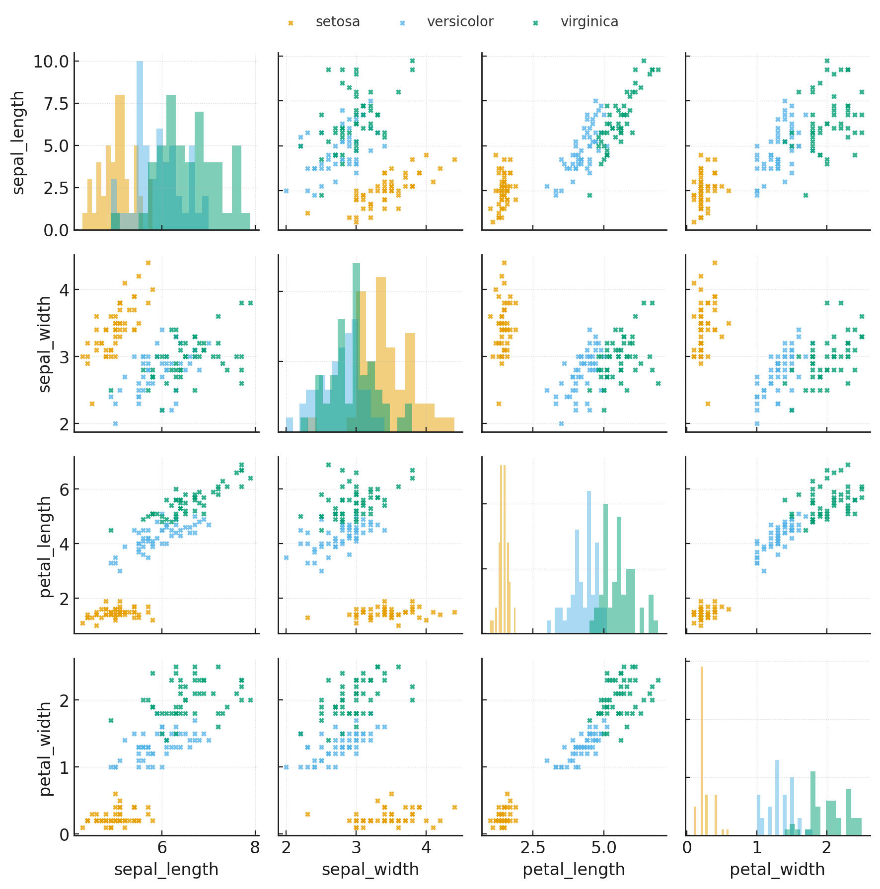

title: Exploración del dataset Iris
date: 2025-01-01

# Exploración del dataset Iris

## Cómo cargué los datos
- Usé `seaborn.load_dataset("iris")` (también se puede con `sklearn.datasets.load_iris()`).
- Librerías: `pandas`, `matplotlib`, `seaborn`.

## Visualizaciones destacadas

### 1) Pairplot (relaciones entre variables)

**Observaciones:**
- Las variables de pétalo (`petal_length`, `petal_width`) separan muy bien las especies.
- `sepal_length` y `sepal_width` tienen más solapamiento entre `versicolor` y `virginica`.

### 2) Heatmap de correlación

**Observaciones:**
- Fuerte correlación entre `petal_length` y `petal_width`.
- `sepal_width` tiene correlaciones más débiles.

## Hallazgos iniciales
- El dataset está balanceado (50 muestras por especie).
- Las variables de pétalo son las más discriminantes.
- Puede haber multicolinealidad (pétalo largo vs ancho).

## Próximos pasos
- Hacer boxplots para explorar outliers.
- Probar un modelo baseline (Logistic Regression o KNN).
- Medir precisión y comparar especies.
