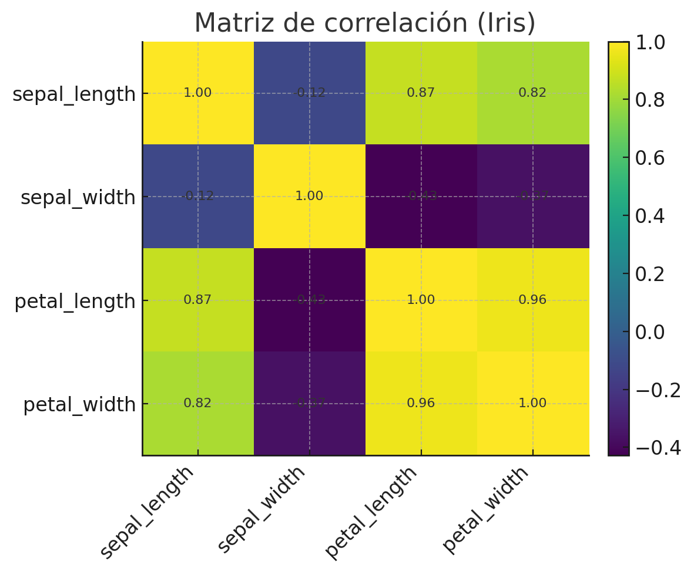

# 🌸 Explorando el dataset Iris

---

# 🌍 Contexto

Esta práctica introductoria corresponde a la **Unidad Temática 1: Exploración y fuentes de datos** del Portafolio de Ingeniería de Datos.  
Se analiza el clásico dataset **Iris** (Fisher, 1936), ampliamente utilizado en aprendizaje automático y estadística.  
El objetivo es comprender cómo las variables de longitud y ancho de pétalos y sépalos permiten **distinguir entre las tres especies de flores (setosa, versicolor y virginica)**.  

Este ejercicio representa la primera aproximación al proceso **CRISP-DM**, abordando la fase de **Comprensión de los datos** mediante técnicas básicas de EDA (*Exploratory Data Analysis*).

---

# 🎯 Objetivos

- Explorar la estructura del dataset Iris y sus variables numéricas.  
- Visualizar relaciones entre pares de variables y las tres especies.  
- Detectar correlaciones y posibles redundancias entre atributos.  
- Identificar qué variables aportan mayor poder de discriminación entre clases.

---

# 📦 Dataset

| Aspecto | Descripción |
|----------|-------------|
| **Fuente** | [Scikit-learn Dataset: Iris](https://scikit-learn.org/stable/datasets/toy_dataset.html#iris-dataset) |
| **Autor original** | R. A. Fisher (1936) |
| **Formato** | DataFrame (4 variables numéricas + 1 categórica) |
| **Tamaño** | 150 observaciones × 5 columnas |
| **Variables** | `sepal_length`, `sepal_width`, `petal_length`, `petal_width`, `species` |
| **Problemas detectados** | Ningún valor faltante o inconsistencia. Se observan posibles correlaciones altas entre variables de pétalo. |

---

# 🧹 Limpieza y preparación de datos

El dataset no presentó valores faltantes ni duplicados.  
Se verificó el tipo de datos de cada columna y se convirtió la variable objetivo (`target`) en etiquetas de texto (`species`) para mejorar la interpretación.

```python
import pandas as pd
from sklearn.datasets import load_iris

iris = load_iris(as_frame=True)
df = iris.frame
df["species"] = df["target"].map(dict(zip(range(3), iris.target_names)))
df.head()
```

---

# 📊 Análisis exploratorio (EDA)

El análisis exploratorio se enfocó en examinar relaciones entre variables numéricas y su capacidad de separar especies.

## 🔹 Pairplot

```python
import seaborn as sns
import matplotlib.pyplot as plt

sns.pairplot(df, hue="species", diag_kind="hist")
plt.show()
```

📈 **Interpretación:**  
- Las variables de **pétalo** (`petal_length`, `petal_width`) muestran una separación muy clara entre especies, especialmente **setosa**.  
- Las variables de **sépalo** presentan mayor solapamiento, indicando menor capacidad discriminante.


---

## 🔹 Heatmap de correlación

```python
corr = df.drop(columns=["target"]).corr()
sns.heatmap(corr, annot=True, cmap="coolwarm")
plt.show()
```

📈 **Interpretación:**  
- Se observa una correlación fuerte (≈ 0.96) entre `petal_length` y `petal_width`, lo que sugiere posible redundancia.  
- Las variables de sépalo (`sepal_length`, `sepal_width`) presentan correlaciones más bajas, lo que puede aportar información complementaria.



### 📝 [Notebook](../../../notebooks/UT1-1.ipynb)
---

# ⚙️ Análisis técnico

- Las visualizaciones confirman que el dataset es **adecuado para problemas de clasificación supervisada multiclase**.  
- La redundancia entre `petal_length` y `petal_width` podría considerarse en la fase de **Feature Selection** (UT3).  
- El EDA evidencia un conjunto de datos **limpio, balanceado y bien estructurado**, ideal para pruebas iniciales de modelos.

---

# 🧠 Resultados y discusión

| Hallazgo | Interpretación |
|-----------|----------------|
| Alta correlación entre variables de pétalo | Posible reducción de dimensionalidad futura |
| Buena separabilidad entre especies | Dataset ideal para clasificación |
| Sin valores faltantes | No se requiere imputación |
| Variables de sépalo poco discriminantes | Podrían tener menor peso en el modelado |

> 💬 **Discusión:**  
> El dataset Iris, aunque sencillo, permite visualizar con claridad el concepto de separabilidad de clases. El análisis demuestra que las variables de pétalo dominan la capacidad predictiva, mientras que las de sépalo aportan matices secundarios.

---

# 🔗 Conexión con otras unidades

Este análisis sienta las bases para el trabajo de las siguientes unidades:  
- **UT2:** Evaluar la calidad y posibles sesgos en datasets más complejos.  
- **UT3:** Aplicar técnicas de *Feature Engineering* considerando las correlaciones detectadas.  
- **UT5:** Integrar este dataset en pipelines reproducibles de preprocesamiento.

---

# 🧩 Reflexión final

Esta práctica me permitió comprender la importancia del análisis exploratorio antes de modelar.  
A través de simples visualizaciones, se pueden detectar relaciones, redundancias y características clave de los datos.  
Aprendí que la etapa de EDA no solo prepara los datos, sino que orienta decisiones futuras de modelado y selección de variables.

> 🌱 *Próximo paso:* aplicar un modelo de clasificación supervisada (KNN o Random Forest) para cuantificar la separabilidad observada.

---

# 🧰 Stack técnico

**Lenguaje:** Python  
**Librerías:** Pandas · Seaborn · Matplotlib · NumPy · Scikit-learn  
**Conceptos aplicados:** EDA · Visualización · Correlación · Comprensión de datos  

---

# 📚 Referencias

- Fisher, R. A. (1936). *The use of multiple measurements in taxonomic problems.* Annals of Eugenics.  
- Práctica original: <https://juanfkurucz.com/ucu-id/ut1/01-exploracion-iris/>  
- Documentación Seaborn: <https://seaborn.pydata.org/>  
- Documentación Scikit-learn: <https://scikit-learn.org/stable/datasets/toy_dataset.html#iris-dataset>