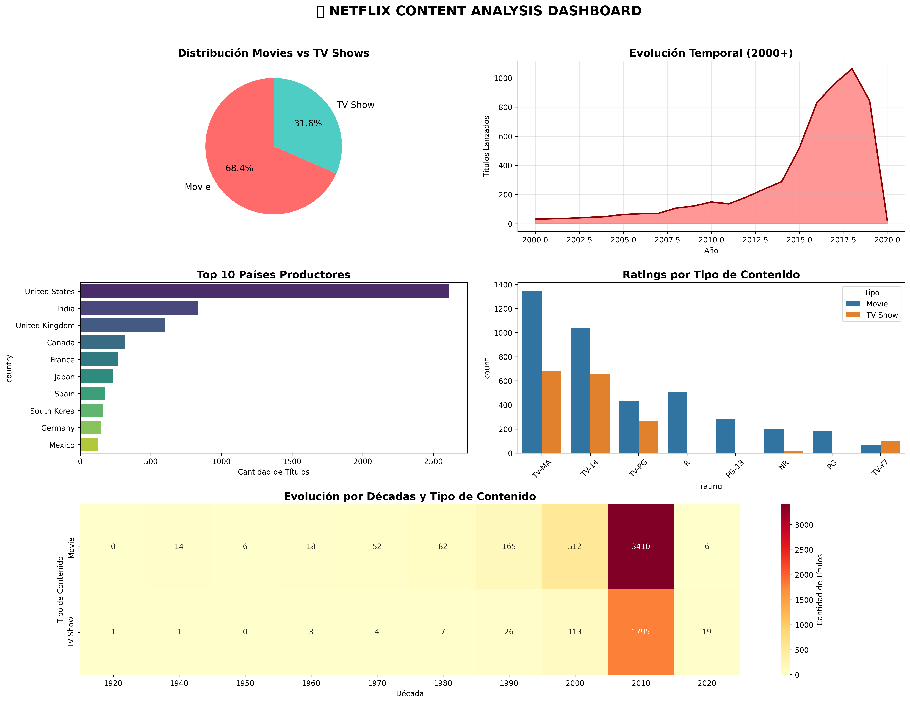

# 🎬 EDA de Netflix con pandas  

---

## 📘 Contexto  

Práctica de **Análisis Exploratorio de Datos (EDA)** aplicada a un dataset de *Netflix*.  
El foco estuvo en:  
- Manipulación con **pandas**.  
- Visualizaciones básicas.  
- Extracción de patrones iniciales para futuras preguntas de negocio.  

---

## 🎯 Objetivos  

- Auditar el dataset (columnas, tipos de datos, valores nulos y duplicados).  
- Visualizar distribuciones relevantes (año de lanzamiento, tipo de contenido).  
- Extraer insights preliminares (países más frecuentes, géneros principales). 

---

## ⏱️ Actividades (con tiempos estimados)  

| Actividad | Tiempo estimado | Resultado esperado |
|-----------|-----------------|--------------------|
| Auditoría de datos (`info`, `describe`, nulos, duplicados) | 20 min | Conocer estructura y calidad |
| Limpieza mínima (parseo de fechas, normalización básica) | 20 min | Dataset estandarizado |
| Visualizaciones y tablas resumen | 30 min | Insights iniciales |

---

## 🛠️ Desarrollo  

1. **Auditoría de datos**  

    - Se revisaron tipos de datos con `df.info()`.  
    - Se identificaron **valores nulos** en columnas como `director`, `cast` y `country`.  
    - Se encontraron duplicados y se eliminaron.  

2. **Limpieza mínima**  

    - Conversión de `date_added` a formato fecha.  
    - Extracción de `year` desde `release_year`.  
    - Normalización básica de categorías.  

3. **Visualizaciones**  

    - Evolución de títulos por año.  
    - Distribución por `type` (Movies vs TV Shows).  
    - Países con mayor cantidad de títulos.  

```python
import pandas as pd
import matplotlib.pyplot as plt

# Cargar dataset
df = pd.read_csv("netflix_titles.csv")

# Auditoría inicial
print(df.info())
print(df.isna().sum())

# Limpieza mínima
df['date_added'] = pd.to_datetime(df['date_added'], errors='coerce')
df['year'] = df['release_year']

# Distribución por tipo
df['type'].value_counts().plot(kind="bar", color=["#1f77b4", "#ff7f0e"])
plt.title("Distribución de contenido por tipo")
plt.show()

# Evolución de títulos por año
df['year'].value_counts().sort_index().plot(kind="line")
plt.title("Lanzamientos por año")
plt.show()
```

---

## 📊 Evidencias  

### 🔹 Dashboard final interactivo  


- Crecimiento fuerte en lanzamientos post-2015.  
- Predominio de **Movies** frente a **TV Shows**.  
- Sesgo geográfico: EE.UU. e India lideran en cantidad de títulos.

### 📝 [Notebook](../../notebooks/UT1-2.ipynb)

---

## 🤔 Reflexión  

- El **EDA inicial** permite detectar problemas de calidad (nulos, duplicados) y generar preguntas relevantes.  
- Observamos que los lanzamientos crecieron en la última década, sobre todo en películas.  
- Futuro trabajo:  
    - Analizar la relación entre **rating y duración**.  
    - Explorar la dinámica por país y género a lo largo del tiempo.  

---

## 📚 Referencias  

- Práctica: <https://juanfkurucz.com/ucu-id/ut1/03-eda-netflix-pandas/>  
- [Documentación pandas](https://pandas.pydata.org/docs/)  
- [Documentación matplotlib](https://matplotlib.org/stable/)