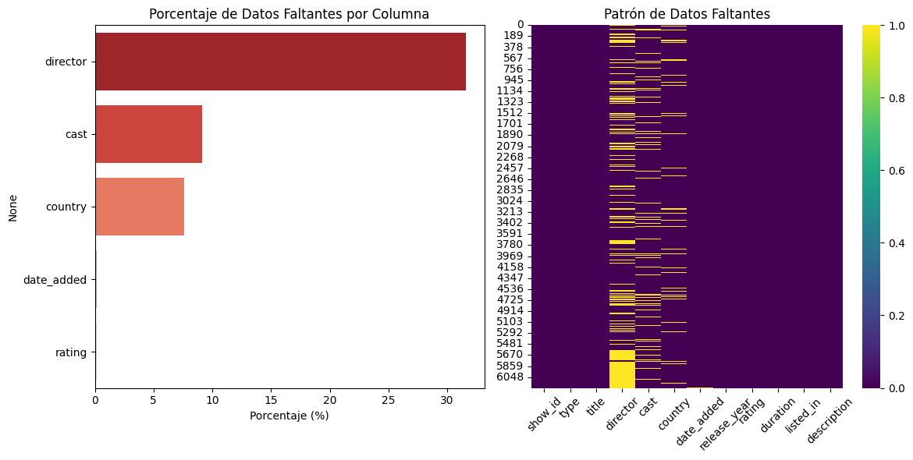
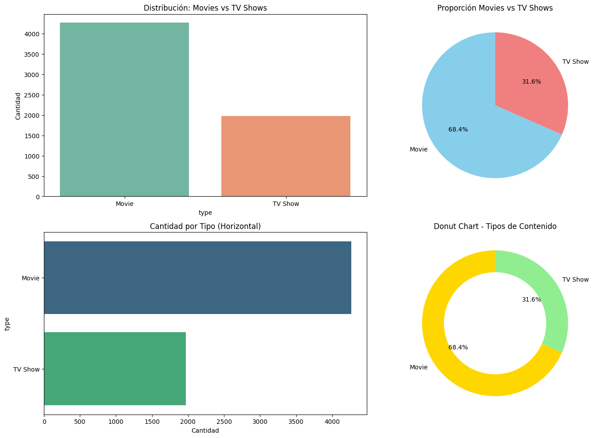
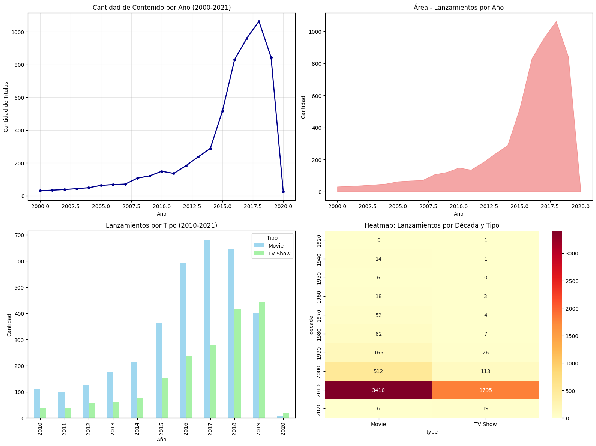
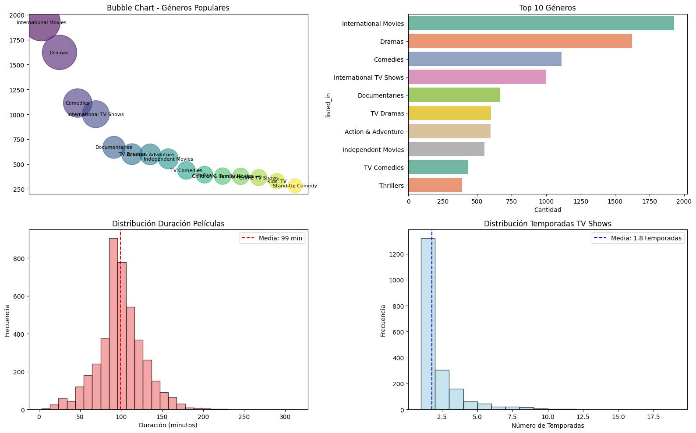

# 🎬 Explorando el catálogo de Netflix

---

# 🌍 Contexto

El catálogo de Netflix contiene miles de películas y series con información sobre país, director, reparto, año de lanzamiento, duración y género.  
A través del **EDA (Exploratory Data Analysis)** busqué responder preguntas iniciales como:

- ¿Predominan las películas o las series?  
- ¿Cómo evolucionó el número de lanzamientos?  
- ¿Qué países concentran más títulos?

Este trabajo marca mi primera interacción con un **dataset real y ruidoso**, enfrentando problemas de formato, nulos y duplicados.

---

# 🎯 Objetivos

- Auditar la estructura y calidad del dataset (tipos de datos, valores nulos, duplicados).  
- Aplicar una **limpieza básica** (normalización de fechas y categorías).  
- Visualizar distribuciones de variables clave: tipo de contenido, año de lanzamiento y país.  
- Extraer patrones y tendencias generales para futuros análisis de comportamiento y producción audiovisual.

---

# 📦 Dataset

| Aspecto | Descripción |
|----------|-------------|
| **Fuente** | Kaggle – [Netflix Movies and TV Shows](https://www.kaggle.com/datasets/shivamb/netflix-shows) |
| **Formato** | CSV |
| **Tamaño** | ~8.800 registros × 12 columnas |
| **Variables principales** | `type`, `title`, `director`, `cast`, `country`, `date_added`, `release_year`, `rating`, `duration`, `listed_in` |
| **Problemas detectados** | Valores nulos frecuentes en `director`, `cast` y `country`; duplicados; inconsistencias en formato de fecha. |

---

# 🧹 Limpieza y preparación

Se realizó una limpieza mínima para asegurar la consistencia de las variables:

- Conversión de `date_added` a tipo **datetime**.  
- Extracción del año desde `release_year`.  
- Eliminación de duplicados.  
- Revisión de valores nulos y normalización básica de texto.

**Figura 1:** Porcentaje y patrón de valores faltantes en las columnas principales.
Las variables `director`, `cast` y `country` presentan las mayores proporciones de nulos, lo que evidencia la necesidad de limpieza y posible imputación.

---

# 📊 Análisis exploratorio (EDA)

## 🔹 Distribución de contenido por tipo

**Figura 2:** Distribución del catálogo entre películas y series.

📈 **Interpretación:**  
Las **películas dominan claramente** el catálogo (≈ 70 %), mientras que las series representan el 30 %.  
Esto refleja que Netflix mantiene su raíz cinematográfica, aunque las series crecen de forma sostenida en los últimos años.

---

## 🔹 Evolución de lanzamientos por año

**Figura 3:** Cantidad de títulos agregados por año.

📈 **Interpretación:**  
Desde **2015 se observa un crecimiento acelerado**, coincidiendo con la expansión global del servicio y la producción de contenido original.  
A partir de 2019, la curva tiende a estabilizarse, lo que podría reflejar saturación del catálogo o mayor curaduría.

---

## 🔹 Países con mayor cantidad de títulos

**Figura 4:** Los diez países con mayor representación en el catálogo.

📈 **Interpretación:**  
El **predominio de Estados Unidos** es claro, seguido por **India** y **Reino Unido**.  
El aumento de títulos asiáticos muestra una tendencia hacia la **diversificación cultural** del contenido.

---

## 🔹 Géneros, duración y temporadas

**Figura 5:** Distribución por género, duración y temporadas

📈 **Interpretación:**  
Los géneros más frecuentes son International Movies, Dramas y Comedies.
La duración media de las películas ronda los **100 minutos**, y la mayoría de las series tiene entre **1 y 2 temporadas**, lo que sugiere predominancia de miniseries o temporadas cortas.

---

## 🔹 Dashboard integrador

**Figura 6:** Panel resumen con métricas clave (tipos de contenido, evolución temporal, países productores y ratings).
Resume las principales tendencias observadas en el EDA.

---

# ⚙️ Análisis técnico

- El dataset presenta calidad aceptable tras limpieza básica.  
- Las visualizaciones revelan **crecimiento sostenido** y **sesgo geográfico**.  
- La falta de uniformidad en `rating` y `country` motiva una futura **normalización por continente o nivel etario**.  
- Este dataset es ideal para practicar **ETL y feature engineering** en etapas posteriores.

---

# 🧠 Resultados y discusión

| Hallazgo | Interpretación |
|-----------|----------------|
| Crecimiento post-2015 | Expansión global de la plataforma |
| Dominio de películas sobre series | Foco principal en contenido cinematográfico |
| Concentración en pocos países | Sesgo geográfico (EE.UU. e India) |
| Presencia de datos faltantes | Oportunidad para limpieza avanzada o imputación |

💬 **Discusión:**  
El análisis revela un dataset heterogéneo con problemas típicos de calidad en fuentes reales.
La tendencia temporal y la concentración geográfica ofrecen una base sólida para estudios de segmentación, diversidad de contenido o predicción de lanzamientos.

---

# 🔗 Conexión con otras unidades

Este proyecto conecta directamente con:
- **UT2:** Evaluar la calidad y sesgos del dataset de Netflix (por país, género o tipo de contenido).  
- **UT3:** Crear nuevas variables (ej. `continent`, `content_length`) para modelos de predicción de popularidad.  
- **UT5:** Integrar el dataset en un pipeline ETL con Spark.

---

# 🧩 Reflexión final

Esta práctica me ayudó a **entender el valor del EDA en datos reales**, donde los problemas de limpieza son inevitables.  
Aprendí que **visualizar primero** simplifica la toma de decisiones y orienta la preparación de features posteriores. 

> 🌱 *Próximos pasos:*  
> Analizar la relación entre **rating, duración y país**, y extender el estudio hacia **recomendación de contenidos** basados en similitud temática.

---

# 🧰 Stack técnico

**Lenguaje:** Python  
**Librerías:** Pandas · Matplotlib · Seaborn · NumPy  
**Conceptos aplicados:** Auditoría de datos · Limpieza básica · Visualización descriptiva · Tendencias temporales

---

# Evidencias

### 📝 [Notebook](../../../notebooks/UT1-2.ipynb)

---

# 📚 Referencias

- Práctica original: <https://juanfkurucz.com/ucu-id/ut1/03-eda-netflix-pandas/>  
- Kaggle Dataset: [Netflix Movies and TV Shows](https://www.kaggle.com/datasets/shivamb/netflix-shows)  
- [Documentación pandas](https://pandas.pydata.org/docs/)  
- [Documentación matplotlib](https://matplotlib.org/stable/)