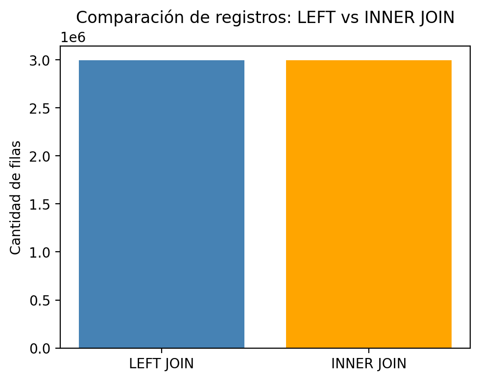
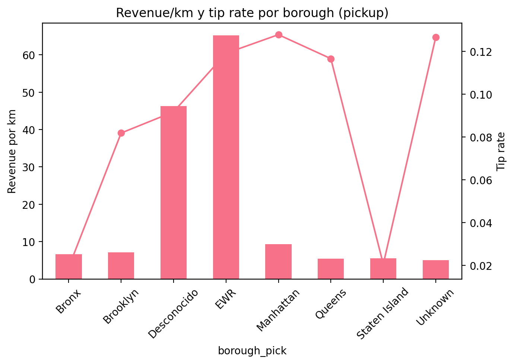

# 🔗 EDA con múltiples fuentes

---

# 🌍 Contexto

Este proyecto pertenece a la **Unidad Temática 1: Exploración y fuentes de datos** del Portafolio de Ingeniería de Datos.  
En esta práctica se aborda la integración de **múltiples fuentes de datos** mediante operaciones de **join** con `pandas.merge`, analizando cómo la unión de datasets complementarios puede enriquecer el análisis y generar información de negocio más completa.

Se trabajó con dos datasets principales:  
- **Trips:** información de viajes (distancia, tarifa, propina, ubicación de inicio).  
- **Zones:** metadatos de las zonas o *boroughs* de la ciudad.  

El objetivo fue comprender las diferencias entre tipos de joins, identificar problemas comunes de integración y analizar patrones de revenue y propinas por zona.

---

# 🎯 Objetivos

- Practicar la combinación de datasets mediante `pandas.merge`.  
- Comparar los resultados obtenidos con `LEFT JOIN` e `INNER JOIN`.  
- Detectar problemas comunes de unión (tipos de datos, IDs faltantes, fechas en distintos formatos).  
- Analizar variables derivadas como revenue total, distancia recorrida y tasa de propinas por borough.

---

# 📦 Datasets

| Aspecto | Descripción |
|----------|-------------|
| **Fuentes** | CSV – *Trips* y *Zones* |
| **Formato** | Tabular |
| **Tamaño aproximado** | *Trips:* miles de registros de viajes · *Zones:* decenas de ubicaciones |
| **Variables principales (Trips)** | `pulocationid`, `fare_amount`, `tip_amount`, `trip_distance`, `tpep_pickup_datetime` |
| **Variables principales (Zones)** | `locationid`, `borough`, `zone`, `service_zone` |
| **Problemas detectados** | Tipos de datos distintos (`int` vs `str`), fechas en formatos variados, IDs sin correspondencia en *Zones*. |

---

# 🧹 Limpieza y preparación de datos

Se importaron ambos datasets y se realizó una exploración inicial:

```python
import pandas as pd

trips = pd.read_csv("trips.csv")
zones = pd.read_csv("zones.csv")

print(trips.info())
print(zones.info())
```

Principales ajustes realizados:
- Conversión de columnas de ID a tipo numérico.  
- Normalización de fechas al formato `datetime`.  
- Verificación de valores faltantes.  
- Chequeo de duplicados y consistencia de claves.

---

# 📊 Análisis exploratorio e integración de datos

## 🔹 Implementación de LEFT JOIN

El **LEFT JOIN** preserva todos los registros del dataset de viajes (*Trips*), incluso si no existe correspondencia en *Zones*.

```python
left_join = trips.merge(zones, how="left", left_on="pulocationid", right_on="locationid")
left_join.head()
```

📈 **Interpretación:**  
Este tipo de join conserva el 100% de los viajes, lo que permite mantener información de transacciones aún sin zona asignada. Ideal para análisis de cobertura o calidad de datos.

---

## 🔹 Implementación de INNER JOIN

El **INNER JOIN** conserva solo los registros con coincidencia en ambos datasets.

```python
inner_join = trips.merge(zones, how="inner", left_on="pulocationid", right_on="locationid")
inner_join.head()
```

📈 **Interpretación:**  
Al eliminar los viajes sin correspondencia, se obtiene un conjunto más consistente pero reducido. Este enfoque es útil cuando se prioriza la integridad sobre la completitud.

---

## 🔹 Problemas comunes detectados

- Diferencias en tipos de datos (`int64` vs `object`).  
- Formatos de fecha heterogéneos (`YYYY-MM-DD` vs `MM/DD/YYYY`).  
- IDs faltantes o zonas inexistentes.  
- Inconsistencias al agrupar por borough debido a registros nulos.  

Estos problemas resaltan la importancia de la **auditoría de claves** antes de cualquier integración.

---

# ⚙️ Análisis técnico: revenue y propinas por borough

A partir del dataset integrado (`left_join`), se calcularon métricas agregadas:

```python
group = left_join.groupby("borough_pick", dropna=False).agg(
    viajes=("pulocationid","size"),
    revenue_total=(lambda x: (left_join.loc[x.index,'fare_amount'] 
                            + left_join.loc[x.index,'tip_amount']).sum()),
    distancia_total=("trip_distance","sum"),
    tip_total=("tip_amount","sum")
)

group["revenue_por_km"] = group["revenue_total"] / group["distancia_total"].replace(0, pd.NA)
group["tip_rate"] = group["tip_total"] / group["revenue_total"].replace(0, pd.NA)

display(group)
```

📊 **Resultados clave:**
- **Manhattan** concentra la mayoría de los viajes y el mayor revenue total.  
- **Queens** presenta distancias más largas y un revenue por km más alto.  
- La **tasa de propinas** varía significativamente entre boroughs.  

---

# 📈 Visualizaciones

### 🔹 Comparación de JOINs  

  

**Figura 1:** Diferencia en cantidad de registros entre LEFT JOIN e INNER JOIN.
El **LEFT JOIN** conserva más registros (incluyendo viajes sin zona), mientras que el **INNER JOIN** filtra los viajes incompletos.

### 🔹 Revenue y propinas por borough 

  

**Figura 2:** Relación entre revenue por km (barras) y tip rate (línea) según el borough de pickup.
Se observan diferencias marcadas: Manhattan lidera en revenue total, mientras que EWR y zonas desconocidas muestran los mayores ingresos por km y tasa de propinas.

---

# 🧠 Resultados y discusión

| Hallazgo | Interpretación |
|-----------|----------------|
| LEFT JOIN conserva todos los viajes | Aumenta cobertura, útil para calidad de datos |
| INNER JOIN filtra viajes sin correspondencia | Útil para análisis de negocio limpio |
| Manhattan concentra mayor revenue | Refleja densidad de viajes cortos y alta frecuencia |
| Variación en tasa de propinas | Indica diferencias socioeconómicas o contextuales |

> 💬 **Discusión:**  
> La integración de fuentes es una de las etapas más delicadas en ingeniería de datos.
> Diferencias mínimas en claves o tipos pueden alterar los resultados.
> Este caso demuestra cómo el tipo de join elegido impacta directamente en la calidad y los insights del análisis.

---

# 🔗 Conexión con otras unidades

Este trabajo conecta con:
- **UT2:** Evaluar la calidad de datos integrados y el impacto de los valores faltantes.  
- **UT3:** Generar nuevas variables a partir de datos combinados (ej. `revenue_por_km`, `tip_rate`).  
- **UT5:** Diseñar pipelines ETL donde la unión de fuentes sea automatizada y reproducible.

---

# 🧩 Reflexión final

Integrar múltiples fuentes de datos permite obtener una **visión más rica y contextualizada** de los procesos analizados.  
Aprendí que la elección entre `LEFT JOIN` e `INNER JOIN` depende del objetivo: **completitud vs consistencia**.  
Además, los errores comunes en tipos de datos o claves son inevitables, por lo que deben ser controlados sistemáticamente en etapas tempranas.

> 🌱 *Próximos pasos:*  
> - Automatizar el pipeline de unión con **Prefect** o **Airflow**.  
> - Implementar versionado de datos con **DVC** para trazabilidad y reproducibilidad.

---

# 🧰 Stack técnico

**Lenguaje:** Python  
**Librerías:** Pandas · NumPy · Matplotlib  
**Conceptos aplicados:** Joins · Integración de fuentes · Limpieza de claves · Agrupaciones y métricas agregadas  

---

# Evidencias

### 📝 [Notebook](../../../notebooks/UT1-3.ipynb)

---

# 📚 Referencias

- Práctica original: <https://juanfkurucz.com/ucu-id/ut1/04-eda-multifuentes-joins/>  
- [Documentación pandas.merge](https://pandas.pydata.org/docs/reference/api/pandas.DataFrame.merge.html)