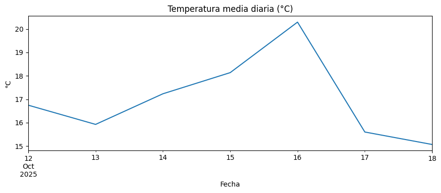
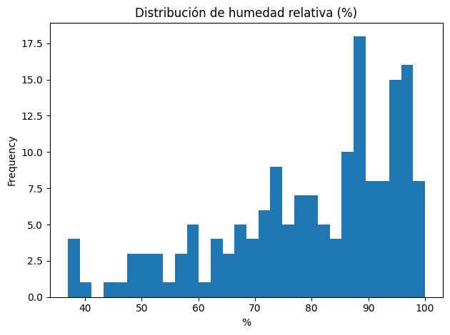
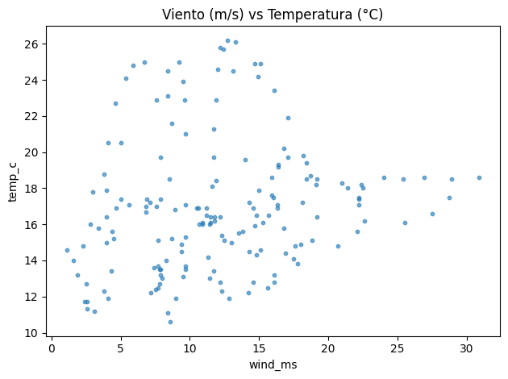

# 🌐 Proyecto extra — Explorando datos meteorológicos desde una API (Open-Meteo)

---

# 🌍 Contexto

Proyecto complementario de la **UT1 – Exploración y Fuentes de Datos**, cuyo objetivo fue integrar una **fuente JSON desde una API pública** y realizar un **EDA básico de series temporales**.  
Usé la API gratuita de **Open-Meteo** para descargar datos horarios de **temperatura**, **humedad relativa** y **velocidad del viento** de Montevideo, demostrando cómo transformar una respuesta JSON anidada en un dataframe limpio y listo para análisis.

---

# 🎯 Objetivos

- Consumir una **API pública** y documentar el request.  
- **Normalizar** la respuesta JSON con `pandas`.  
- Manejar **timezones** y estructurar una serie temporal.  
- Realizar un **EDA descriptivo** con resampling diario, distribuciones y correlaciones simples.  
- Guardar los resultados en formato **parquet/csv** para reproducibilidad.

---

# 📦 Fuente de datos

| Aspecto | Detalle |
|---|---|
| API | Open-Meteo (gratuita, sin API key) |
| Endpoint | `/v1/forecast?latitude=...&longitude=...` |
| Variables | `temperature_2m`, `relative_humidity_2m`, `wind_speed_10m` (hourly) |
| Zona horaria | configurable (`timezone=auto`) |
| Formato | JSON anidado (`hourly.time`, `hourly.temperature_2m`, …) |

---

# 🧰 Requisitos

```bash
pip install pandas pyarrow requests matplotlib
```

---

# 🛠️ Ingesta + Normalización (código)

```python
import requests, pandas as pd, json
from pathlib import Path

LAT, LON = -34.9011, -56.1645
URL = "https://api.open-meteo.com/v1/forecast"
PARAMS = {
    "latitude": LAT,
    "longitude": LON,
    "hourly": "temperature_2m,relative_humidity_2m,wind_speed_10m",
    "timezone": "auto"
}

r = requests.get(URL, params=PARAMS)
r.raise_for_status()
raw = r.json()

hourly = raw["hourly"]
df = pd.DataFrame(hourly)
df["time"] = pd.to_datetime(df["time"])
df = df.set_index("time").sort_index()
df.to_parquet("data/hourly_montevideo.parquet")
df.head()
```

📈 **Interpretación:**
La estructura JSON se normalizó en columnas horarias de temperatura, humedad y viento.
El índice temporal facilita el análisis de tendencias, resampling y operaciones por fecha.

---

# 🧹 Limpieza mínima

```python
# Renombrado amistoso
df = df.rename(columns={
    "temperature_2m": "temp_c",
    "relative_humidity_2m": "rh_pct",
    "wind_speed_10m": "wind_ms"
})

# Filtros y validaciones simples
df = df[(df["temp_c"].between(-40, 60)) & (df["rh_pct"].between(0, 100)) & (df["wind_ms"].between(0, 60))]
summary = df.describe()
summary
```

**Resultado:** no se detectaron valores extremos fuera de rangos físicos.
Esto permitió continuar con análisis sin imputaciones adicionales.

---

# 📊 EDA visual

## 🔹 Evolución diaria de la temperatura media

  

**Figura 1:** Serie temporal suavizada por promedio diario.
Se aprecian ciclos térmicos coherentes con la oscilación día/noche y picos asociados a frentes cálidos.

---

## 🔹 Distribución de humedad relativa



**Figura 2:** Histograma de humedad relativa.
Predomina un rango medio-alto (60-90 %), típico de un clima costero húmedo; las colas altas coinciden con días lluviosos.

---

## 🔹 Relación viento–temperatura



**Figura 3:** Dispersión entre viento (m/s) y temperatura (°C).
No se observa correlación lineal significativa, lo que sugiere que las variaciones térmicas locales dependen más de factores de radiación y presión que del viento.

---

# 🧠 Resultados y discusión

| Hallazgo | Interpretación |
|---|---|
| Variabilidad diaria de temperatura | Picos y valles coherentes con ciclos día/noche y condiciones locales. |
| Humedad centrada en rangos medios-altos | Consistente con clima costero; colas altas en días lluviosos. |
| Viento y temperatura con correlación baja | Fenómeno más influido por presión/sistemas frontales que por temperatura local. |

> 💬 **Discusión:**  
> Este ejercicio muestra el potencial de las APIs meteorológicas para alimentar dashboards, modelos predictivos o pipelines de monitoreo.  
> La principal dificultad fue manejar los **timezones** y validar los rangos físicos de las variables.

---

# 🔗 Conexión con otras unidades

- **UT2:** calidad de datos (faltantes en API, picos espurios) y **pipelines** de limpieza.
- **UT3:** *feature engineering* temporal (lags, rolling mean) y codificación estacional (mes/día).

---

# ⚖️ Consideraciones éticas / licencia

- La API es **pública** y gratuita; citar **Open-Meteo** en el repositorio.  
- Documentar **limitaciones** (horizonte corto, posibles cortes del servicio).  
- Evitar sobrecargar el endpoint (incluir **caché** local como arriba).

---

# 🧰 Stack técnico

**Python** · `requests` · `pandas` · `matplotlib` · `pyarrow` (parquet)

---

# 📂 Artefactos

- `data/openmeteo/raw_response.json` (crudo)
- `data/openmeteo/hourly_montevideo.parquet` y `.csv` (normalizados)

---

# Evidencias

### 📝 [Notebook](../../../notebooks/UT1-Extra.ipynb)

---

# 📚 Referencias

- Open-Meteo API (Forecast): https://open-meteo.com/en/docs
- [Pandas IO JSON](https://pandas.pydata.org/pandas-docs/stable/user_guide/io.html#io-json)
- [Time series resampling](https://pandas.pydata.org/pandas-docs/stable/user_guide/timeseries.html#dateoffset-objects)