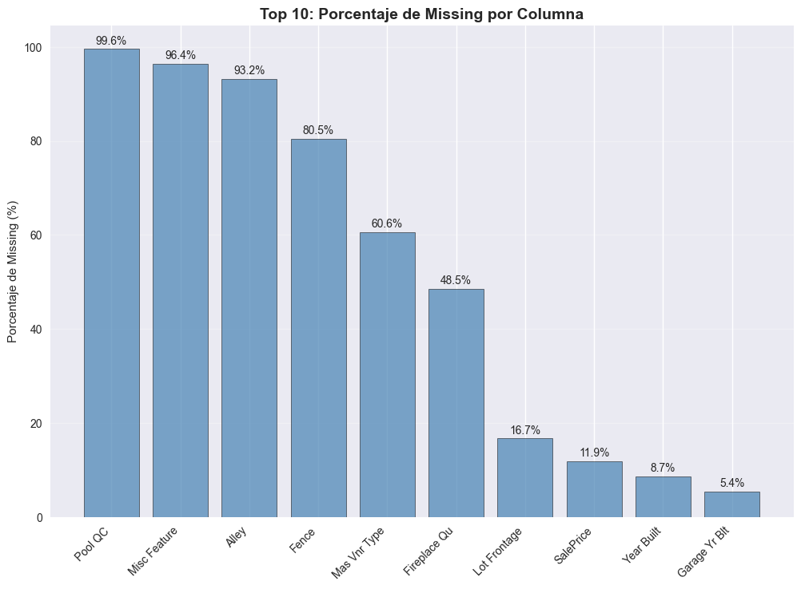

# 🕵️ Missing Data Detective

---

# 🌍 Contexto

Esta práctica pertenece a la **Unidad Temática 2: Calidad y Ética de los Datos**, donde se abordan los problemas de **completitud y confiabilidad** de la información.  
El objetivo es aprender a detectar, analizar y tratar **valores faltantes y outliers**, comprendiendo su impacto en el análisis posterior y garantizando la reproducibilidad mediante pipelines de limpieza.

El ejercicio trabaja con escenarios que representan distintos mecanismos de ausencia (MCAR, MAR y MNAR), aplicando estrategias de imputación controlada y documentando el proceso de forma transparente y ética.

---

# 🎯 Objetivos

- Detectar y clasificar valores faltantes según su mecanismo (MCAR, MAR, MNAR).  
- Identificar outliers mediante métodos estadísticos (IQR, z-score).  
- Aplicar estrategias de imputación apropiadas (media, mediana, forward/backward fill).  
- Diseñar un **pipeline reproducible de limpieza** en Python.  
- Reflexionar sobre las **implicaciones éticas** del tratamiento de datos incompletos.

---

# 📦 Dataset

| Aspecto | Descripción |
|----------|-------------|
| **Fuente** | [Práctica oficial – Missing Data Detective](https://juanfkurucz.com/ucu-id/ut2/05-missing-data-detective/) |
| **Formato** | CSV |
| **Tamaño** | ~1 000 observaciones × 20 variables |
| **Problemas esperados** | Faltantes, outliers y correlaciones alteradas tras la imputación. |
| **Escenario** | Datos simulados con distintos mecanismos de ausencia (MCAR, MAR, MNAR). |

---

# 🧹 Limpieza y preparación de datos

```python
import pandas as pd
import seaborn as sns
import matplotlib.pyplot as plt

df = pd.read_csv("dataset_missing.csv")

# Conteo y visualización de nulos
print(df.isna().sum())
sns.heatmap(df.isna(), cbar=False)
plt.title("Mapa de valores faltantes")
plt.show()
```

📈 **Interpretación:**  
Se detectaron columnas con una alta proporción de valores faltantes, sobre todo en variables relacionadas con características estructurales y de equipamiento (piscina, cercado, garaje).

---

# 📊 Análisis de patrones de ausencia

## 🔹 Top 10 columnas con mayor porcentaje de missing

  

**Figura 1:** Las variables PoolQC, MiscFeature y Alley presentan más del 90 % de datos faltantes.

---

## 🔹 Distribución de missing por fila

  

**Figura 2:** La mayoría de las filas contiene entre 4 y 6 valores faltantes, indicando que las ausencias se concentran en pocos campos clave.

📈 **Interpretación:**
El patrón sugiere un mecanismo MAR (Missing At Random), ya que las ausencias dependen de otras variables observadas, como el tipo de vivienda o su antigüedad.

---

# ⚙️ Identificación de outliers

  

**Figura 3:** Detección mediante boxplots logarítmicos e IQR. Los outliers se concentran en `SalePrice`, `LotArea` y `GarageArea`.

📊 **Interpretación:**  
Los límites del rango intercuartílico (IQR) fueron más robustos frente a distribuciones sesgadas que el z-score, permitiendo conservar observaciones válidas sin recorte excesivo.

---

# 🧠 Imputación de valores

```python
from sklearn.impute import SimpleImputer

imputer = SimpleImputer(strategy="median")
df["columna"] = imputer.fit_transform(df[["columna"]])
```

💡 **Estrategias aplicadas:**  
- **Mediana:** para variables numéricas sesgadas.  
- **Forward / Backward Fill:** para columnas temporales.  
- **Categorías más frecuentes:** en variables nominales.

La imputación con **mediana** mantuvo la forma original de la distribución y minimizó el sesgo.

---

# 📈 Comparación antes y después de la imputación

  

**Figura 4:** Comparación de distribuciones antes y después de imputar.
Se observa mínima alteración en la densidad de las variables principales.

  

**Figura 5:** Matrices de correlación antes (izquierda) y después (derecha) de imputar.
Las correlaciones se mantuvieron estables, confirmando que la imputación no distorsionó las relaciones entre variables.

---

# 🧩 Pipeline reproducible

El proceso se encapsuló en funciones para detectar nulos, imputar según tipo de variable y validar la completitud final.
Esto permite aplicar la misma limpieza sobre nuevos datasets manteniendo trazabilidad y reproducibilidad.

---

# 🧠 Resultados y discusión

| Aspecto | Hallazgo | Interpretación |
|----------|-----------|----------------|
| Mecanismo MAR predominante | Ausencias ligadas al tipo de vivienda | No aleatorias → deben imputarse con contexto |
| Imputación con mediana | Estable y no distorsiona correlaciones | Adecuada para datos asimétricos |
| Outliers controlados | Reducción de sesgo en métricas | Evita sesgos en modelos posteriores |
| Pipeline reproducible | Limpieza transparente y trazable | Mejora la calidad y ética del proceso |

> 💬 **Discusión:**  
> La imputación es tanto un desafío técnico como ético: reemplazar valores implica asumir supuestos que deben documentarse.  
> Una buena práctica es conservar los indicadores de imputación para futuras auditorías.

---

# 🔗 Conexión con otras unidades

- **UT1:** Amplía el análisis exploratorio incorporando la dimensión de calidad y completitud.  
- **UT3:** La limpieza reproducible mejora el proceso de *Feature Engineering*.  
- **UT5:** El pipeline podrá integrarse en un flujo ETL automatizado.

---

# 🧩 Reflexión final

Comprendí que los valores faltantes no son solo “errores”, sino **información en sí mismos**.  
El reto está en tratarlos sin distorsionar la realidad ni introducir sesgos ocultos.  
El equilibrio entre completitud, precisión y ética es clave en la ingeniería de datos.

---

# 🧰 Stack técnico

**Lenguaje:** Python  
**Librerías:** Pandas · Seaborn · Matplotlib · NumPy · Scikit-learn  
**Conceptos aplicados:** MCAR-MAR-MNAR · Imputación · Outliers · Pipeline reproducible  

---

# Evidencias

### 📝 [Notebook](../../../notebooks/UT2-1.ipynb)

---

# 📚 Referencias

- Práctica: <https://juanfkurucz.com/ucu-id/ut2/05-missing-data-detective/>  
- Little, R. J. A. & Rubin, D. B. (2019). *Statistical Analysis with Missing Data.*  
- [scikit-learn Imputers](https://scikit-learn.org/stable/modules/impute.html)