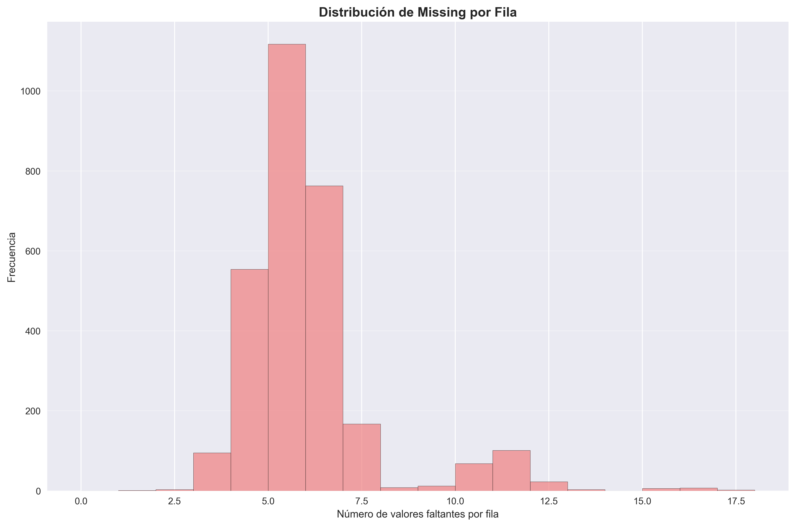
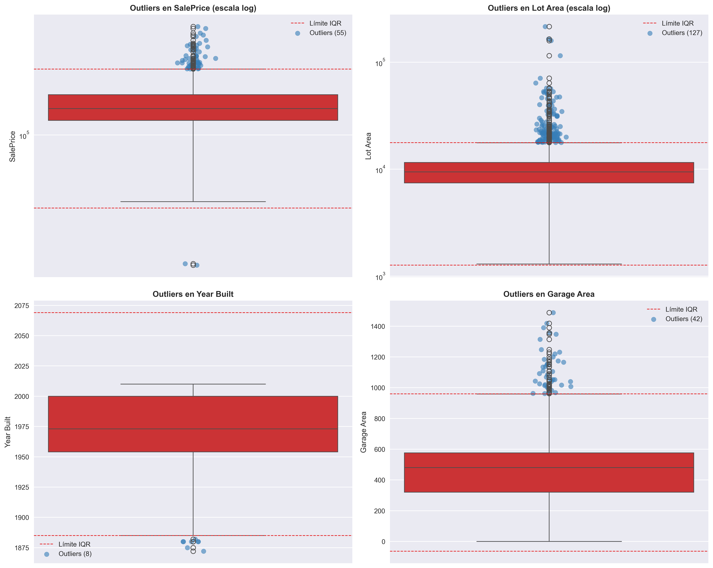
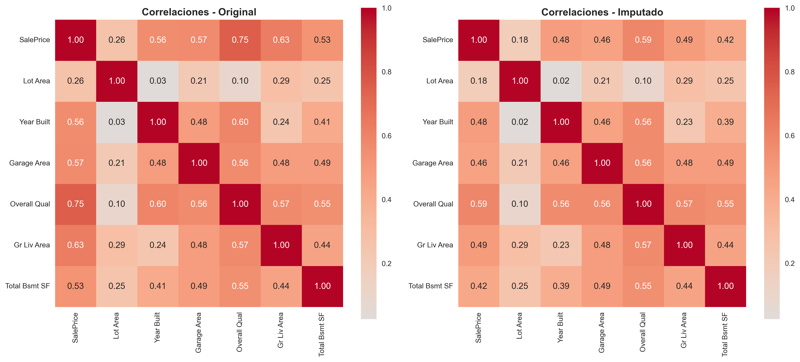

# 🕵️ Missing Data Detective  

---

## 📘 Contexto  

Práctica centrada en la **detección, análisis y tratamiento de datos faltantes**.  
El objetivo fue comprender cómo los datos incompletos afectan el análisis y aplicar estrategias adecuadas de limpieza e imputación.  

Se trabajó con distintos escenarios de *missing values* (MCAR, MAR, MNAR), outliers estadísticos y la construcción de pipelines reproducibles.  

---

## 🎯 Objetivos  

- Aprender a detectar y analizar datos faltantes (MCAR, MAR, MNAR).  
- Identificar outliers usando métodos estadísticos.  
- Implementar estrategias de imputación apropiadas.  
- Crear pipelines de limpieza reproducibles.  
- Considerar aspectos éticos en el tratamiento de datos.  

---

## ⏱️ Actividades (con tiempos estimados)  

| Actividad | Tiempo estimado | Resultado esperado |
|-----------|-----------------|--------------------|
| Detección de valores nulos | 20 min | Mapas y métricas de completitud |
| Clasificación MCAR, MAR, MNAR | 20 min | Entendimiento de mecanismos de ausencia |
| Identificación de outliers | 25 min | Detección con boxplots, z-scores e IQR |
| Imputación de valores | 30 min | Estrategias mean/median, ffill/bfill |
| Construcción de pipeline | 25 min | Proceso reproducible de limpieza |

---

## 🛠️ Desarrollo  

1. **Detección de nulos**  
```python
import pandas as pd
import seaborn as sns
import matplotlib.pyplot as plt

df = pd.read_csv("dataset_missing.csv")

# Conteo de nulos
print(df.isna().sum())

# Visualización
sns.heatmap(df.isna(), cbar=False)
plt.show()
```
    - Se identificaron columnas con alta proporción de valores faltantes.

2. **Clasificación de mecanismos**

    - MCAR: ausencia completamente aleatoria.  
    - MAR: ausencia depende de otras variables observadas.  
    - MNAR: ausencia depende del propio valor faltante. 

3. **Outliers**
```python
import numpy as np

# Identificación de outliers con IQR
Q1 = df["columna"].quantile(0.25)
Q3 = df["columna"].quantile(0.75)
IQR = Q3 - Q1

outliers = df[(df["columna"] < Q1 - 1.5*IQR) | (df["columna"] > Q3 + 1.5*IQR)]
outliers.head()
```
    - Los outliers fueron detectados con el rango intercuartílico (IQR) y z-scores.

4. **Imputación de valores**
```python
from sklearn.impute import SimpleImputer

# Imputación con mediana
imputer = SimpleImputer(strategy="median")
df["columna"] = imputer.fit_transform(df[["columna"]])
df.head()
```
    - Se probaron distintas estrategias (mean, median, most_frequent, ffill).

5. **Pipeline reproducible**

    - Construcción de funciones para detectar, imputar y validar.
    - Asegurar que el proceso sea replicable en otros datasets.

---

## 📊 Evidencias  

### 🔹 Patrones de datos faltantes  


- Top columnas con mayor porcentaje de valores faltantes.  
- Distribución de filas según cantidad de nulos.  

---

### 🔹 Outliers detectados  


- Detección de valores atípicos en variables clave (`SalePrice`, `Lot Area`, `Garage Area`).  
- Uso de boxplots e IQR.  

---

### 🔹 Distribución antes y después de imputación  


- Comparación de histogramas y gráficas de barras.  
- La imputación con mediana preserva mejor la forma de la distribución.  

---

### 🔹 Correlaciones originales vs imputadas  


- Comparación de matrices de correlación antes y después de imputar.  
- Diferencias mínimas, lo que sugiere que la imputación elegida no distorsionó demasiado las relaciones.   

---

## 🤔 Reflexión  

- Detectar y tratar datos faltantes es **crítico** antes de cualquier modelado.  
- No existe una estrategia universal: depende del contexto, el dominio y los objetivos del análisis.  
- El pipeline reproducible asegura trazabilidad y minimiza errores manuales.  
- Consideración ética: imputar datos puede introducir sesgos si no se documenta adecuadamente.  

---

## 📚 Referencias  

- Práctica: <https://juanfkurucz.com/ucu-id/ut2/05-missing-data-detective/>  
- [scikit-learn imputers](https://scikit-learn.org/stable/modules/impute.html)  
- Little, R.J.A., & Rubin, D.B. (2019). *Statistical Analysis with Missing Data*.  