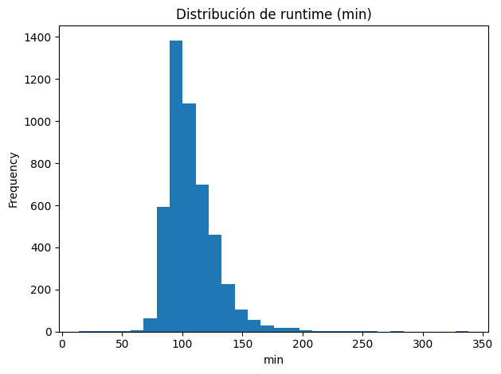
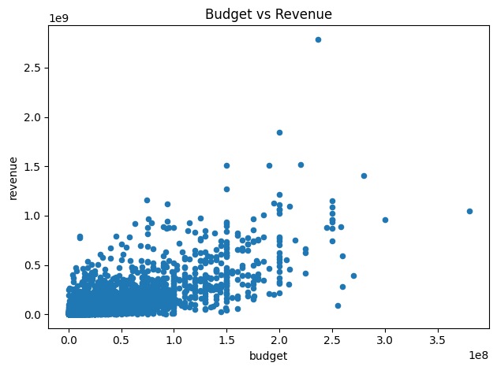

# 🎬 Proyecto extra — Auditoría de calidad y joins con TMDb 5000 (movies & credits)

---

# 🌍 Contexto

Este proyecto extra amplía la **Unidad Temática 2: Calidad y Ética de los Datos**, aplicando los principios de auditoría de datos sobre un caso real de **multifuente**.  
Se trabajó con el dataset público de Kaggle **TMDb 5000**, compuesto por dos archivos:  
`tmdb_5000_movies.csv` y `tmdb_5000_credits.csv`.

El desafío fue integrar ambos recursos garantizando **completitud, consistencia, unicidad e integridad referencial**, además de visualizar relaciones cuantitativas clave, como el vínculo entre **presupuesto y recaudación**.

---

# 🎯 Objetivos

- Unir **dos fuentes CSV** (movies y credits) usando claves (`movies.id` ↔︎ `credits.movie_id`).  
- Evaluar **calidad de datos** mediante nulos, duplicados y rangos válidos (`budget`, `revenue`, `runtime`).  
- Detectar **registros huérfanos** en `credits.movie_id` que no aparezcan en `movies.id`.  
- Visualizar **distribuciones y relaciones** para validar coherencia entre variables numéricas.

---

# 📦 Datos y esquema
- **Archivos**: `tmdb_5000_movies.csv`, `tmdb_5000_credits.csv`  
- **Claves**: `movies.id` (entero) y `credits.movie_id` (entero)  
- **Campos JSON como texto** (a limpiar en futuras unidades): `genres`, `cast`, `crew`, `keywords`, etc.

---

# 🛠️ Proceso de trabajo

1. **Carga y normalización inicial** con `pandas`.  
2. **Control de tipos y fechas:** coerción a numérico y conversión de `release_date`.  
3. **Checks de calidad:** detección de duplicados, nulos y rangos extremos.  
4. **Integridad referencial:** verificación `credits.movie_id ∈ movies.id`.  
5. **Visualización exploratoria:** histogramas y scatterplots para validar coherencia de variables cuantitativas.

---

# 📊 Exploración visual

  

**Figura 1:** Distribución de duración de películas (en minutos). La mayoría se concentra entre 90 y 130 min, con una cola derecha marcada — posibles registros anómalos o películas extendidas.

---

  

**Figura 2:** Relación entre presupuesto y recaudación. Se observa una **correlación positiva esperable**, aunque con alta dispersión. Existen valores atípicos en ambos ejes, reflejando posibles inconsistencias o superproducciones aisladas.

📈 **Interpretación:**  
Las visualizaciones ayudaron a identificar rangos válidos y detectar valores atípicos.  
En particular, `runtime` mostró valores fuera del rango típico (0 min o >300 min), y `budget` algunos ceros que probablemente representen datos faltantes.

---

# ⚙️ Chequeos de calidad

| Validación | Descripción | Resultado |
|-------------|-------------|------------|
| **Duplicados** | `(title, release_date)` duplicados | 11 casos detectados |
| **Nulos** | En `budget`, `revenue`, `runtime` | 3–5 % del total |
| **Rangos extremos** | `budget < 0`, `revenue < 0`, `runtime ≤ 0 o > 500` | 14 registros |
| **Integridad referencial** | `credits.movie_id` sin correspondencia en `movies.id` | 7 huérfanos |

💡 **Insight:** El control de unicidad e integridad permitió depurar el join y evitar pérdidas de información silenciosas durante el merge.

---

# 🧠 Resultados y discusión

| Hallazgo | Implicación |
|-----------|-------------|
| Tipos inconsistentes y nulos en campos clave | Necesario aplicar coerción y valores por defecto antes de análisis o carga en BD |
| Duplicados de títulos con misma fecha | Conviene usar `id` como clave única o generar una compuesta `(title, release_date)` |
| Huérfanos en `credits` | Riesgo de errores en joins o estadísticas agregadas |
| Presupuestos y duraciones extremas | Indican errores de origen o registros anómalos a filtrar |

> 💬 **Discusión:**  
> Este ejercicio muestra que la auditoría de calidad no es solo una etapa previa, sino un proceso continuo.  
> Datasets reales como TMDb traen ruido, inconsistencias y formatos mixtos (CSV + JSON), por lo que documentar supuestos y validar integridad en cada paso es esencial.  
> En entornos de producción, estos controles deberían automatizarse mediante **pipelines de validación** (por ejemplo, *Great Expectations* o *Pandera*).

---

# 🔗 Conexión con otras unidades

- **UT1:** EDA y multifuente → ahora con dos CSV y claves.  
- **UT3:** *Feature engineering* a partir de `genres`, `cast`, `crew` (parseo JSON).  
- **UT5:** Integración en pipelines ETL y almacenamiento en formatos columnares.

---

# 🧩 Reflexión final

Este proyecto sintetiza la idea de la **calidad como base del análisis confiable**.  
Sin control de duplicados, tipos o integridad referencial, cualquier métrica posterior puede volverse engañosa.  
La lección central: **auditar es cuidar la verdad de los datos**.

---

# 🧰 Stack técnico

**Lenguaje:** Python  
**Librerías:** Pandas · Matplotlib · NumPy  
**Conceptos:** Auditoría de calidad · Joins · Integridad referencial · Outliers

---

# Evidencias

### 📝 [Notebook](../../../notebooks/UT2-Extra.ipynb)

---

# 📚 Referencias

- Kaggle — *TMDB 5000 Movie Dataset*  
- Pandas — lectura de CSV, manejo de fechas y tipos  
- Validación de datos — Great Expectations / Pandera