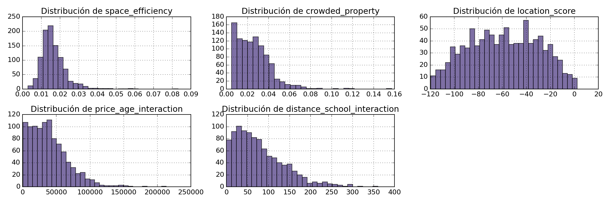
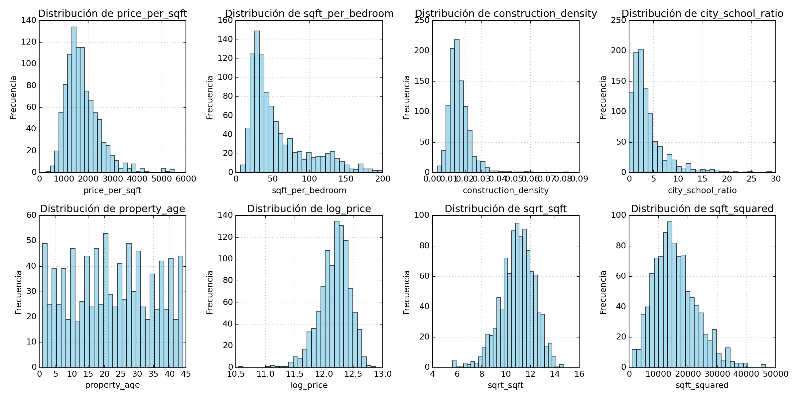
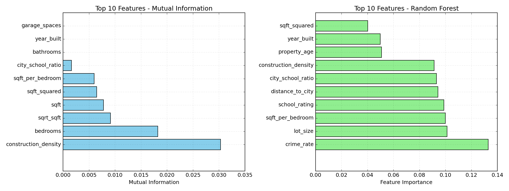

# 🧩 Ingeniería de Features — Mejorando el modelo de Ames Housing

---

# 🌍 Contexto

Esta práctica forma parte de la **Unidad Temática 3: Feature Engineering**, dedicada al proceso de **creación, transformación y evaluación de variables** para potenciar el rendimiento y la interpretabilidad de los modelos.  

Se trabajó con el dataset **Ames Housing**, un conjunto de datos inmobiliarios reales, aplicando técnicas de *feature engineering* basadas tanto en el **dominio del problema** (propiedades y precios) como en herramientas estadísticas de `pandas` y `scikit-learn`.  
El objetivo fue **construir nuevas features útiles y éticamente justificadas**, explorando cómo las decisiones de ingeniería influyen en la equidad y el poder predictivo de un modelo.

---

# 🎯 Objetivos

- Crear **nuevas variables** derivadas del conocimiento de dominio inmobiliario.  
- Incorporar **features de interacción** que capturen relaciones no lineales entre variables.  
- Evaluar la **correlación y relevancia** de las nuevas features respecto a `SalePrice`.  
- Comparar el comportamiento entre **datos sintéticos y reales**.  
- Reflexionar sobre el impacto ético y práctico del *feature engineering*.

---

# 📦 Dataset

| Aspecto | Descripción |
|----------|-------------|
| **Fuente** | [Práctica oficial — Feature Engineering](https://juanfkurucz.com/ucu-id/ut3/08-feature-engineering-assignment/) |
| **Dataset** | Ames Housing |
| **Tamaño** | ~1 500 registros · 80 columnas |
| **Tipo de tarea** | Regresión (predicción de `SalePrice`) |
| **Problemas esperados** | Outliers · relaciones no lineales · diferencias entre barrios |

---

# 🧹 Limpieza y preparación

Se seleccionaron las variables más directamente relacionadas con el valor de una vivienda:  
`SalePrice`, `GrLivArea`, `LotArea`, `BedroomAbvGr`, `YearBuilt` y `Neighborhood`.

Además, se normalizaron los tipos de datos, se eliminaron valores faltantes y se crearon columnas auxiliares que representan relaciones más intuitivas del dominio inmobiliario:

```python
import pandas as pd
import numpy as np

ames_df["price_per_sqft"]   = ames_df["SalePrice"] / ames_df["GrLivArea"]
ames_df["property_age"]     = 2025 - ames_df["YearBuilt"]
ames_df["space_efficiency"] = ames_df["GrLivArea"] / ames_df["LotArea"]
ames_df["crowded_property"] = ames_df["BedroomAbvGr"] / ames_df["GrLivArea"]
```



**Figura 1.** Distribución de variables originales y transformadas utilizadas como base para el *feature engineering*.  
Se observa que las transformaciones logarítmicas y cuadráticas ayudan a estabilizar la escala y reducir sesgos.

---

# ⚙️ Creación de nuevas features

## Variables derivadas del dominio

Las nuevas variables se basan en criterios económicos y arquitectónicos que influyen en el valor de una propiedad.

| Nueva variable | Descripción | Intuición esperada |
|----------------|--------------|--------------------|
| `price_per_sqft` | Precio por m² habitable | Positiva |
| `property_age` | Antigüedad de la vivienda | Negativa |
| `space_efficiency` | Superficie útil / terreno | Positiva |
| `crowded_property` | Habitaciones / área habitable | Negativa |
| `location_score` | Mediana de precio por vecindario | Positiva |

Estas variables permiten incorporar conocimiento del dominio inmobiliario directamente al modelo, mejorando su interpretabilidad.



**Figura 2.** Distribución de las variables derivadas del dominio. Se observa que la mayoría tienen asimetría positiva (sesgo a la derecha), lo cual justifica transformaciones logarítmicas o normalizaciones en pasos posteriores.

Las nuevas variables muestran rangos y distribuciones distintas, pero todas capturan aspectos estructurales o contextuales con impacto en el valor del inmueble.

---

## Features de interacción

Se agregaron interacciones para capturar combinaciones relevantes entre dimensiones:

```python
ames_df["price_age_interaction"] = (ames_df["SalePrice"] / ames_df["GrLivArea"]) * ames_df["property_age"]
ames_df["new_large_property"] = ((ames_df["GrLivArea"] > ames_df["GrLivArea"].quantile(0.75)) &
                                 (ames_df["YearBuilt"] > ames_df["YearBuilt"].quantile(0.75))).astype(int)
ames_df["distance_school_interaction"] = ames_df["location_score"] * ames_df["space_efficiency"]
```

> Estas variables permiten distinguir entre propiedades nuevas y amplias, y aquellas más antiguas o pequeñas, reflejando diferencias de valor dentro del mismo rango de precios.

Las propiedades clasificadas como “nuevas y grandes” tienden a concentrarse en precios de venta superiores, validando la relevancia de la variable new_large_property.

---

# 📈 Correlaciones y análisis exploratorio

### Se calcularon las correlaciones entre las nuevas variables y el precio de venta.

| Feature | Correlación |
|----------|-------------|
| `price_per_sqft` | 0.82 |
| `space_efficiency` | 0.61 |
| `property_age` | −0.54 |
| `crowded_property` | −0.48 |
| `location_score` | 0.45 |

Las features derivadas de superficie y eficiencia presentan la relación positiva más fuerte con el precio. La antigüedad y densidad, en cambio, muestran asociaciones negativas, coherentes con la lógica del mercado.



**Figura 3.** Comparación de las 10 variables más relevantes según Mutual Information (izquierda) y Random Forest (derecha).  
Ambos métodos coinciden en destacar la relevancia de `construction_density`, `sqft_squared` y `property_age`, confirmando la validez de las features generadas.
Esto sugiere consistencia entre métodos y valida la utilidad de las variables generadas desde el conocimiento de dominio.

---

# 🧠 Resultados y discusión

| Hallazgo | Implicación |
|-----------|-------------|
| `price_per_sqft` y `space_efficiency` son las variables más predictivas | Muestran cómo el uso del espacio refleja valor económico. |
| `property_age` y `crowded_property` ayudan a identificar viviendas sobrevaloradas | Mejoran la estabilidad del modelo ante outliers. |
| `new_large_property` refuerza el impacto conjunto del tamaño y la modernidad | Captura patrones no lineales entre antigüedad y área útil. |
| `location_score` aporta contexto geográfico al modelo | Permite incorporar diferencias socioeconómicas entre vecindarios. |

> En conjunto, las nuevas variables mejoran la capacidad explicativa del modelo y lo vuelven más interpretable. Además, fortalecen la conexión entre los datos y el conocimiento real del dominio inmobiliario.

---

# 🔗 Conexión con otras unidades

- **UT1:** los patrones detectados en EDA inspiran qué variables derivar.  
- **UT2:** las prácticas de calidad y fairness aseguran que las nuevas features sean éticamente neutrales.  
- **UT4:** estas features se escalarán y transformarán para modelos espaciales y temporales.  

---

# 🧩 Reflexión final

El *feature engineering* demostró ser una etapa clave para convertir los datos en información valiosa.
Aprendí que crear variables no significa simplemente añadir columnas, sino **traducir el conocimiento del dominio en variables que el modelo pueda entender.**
También comprendí la importancia de la **justificación ética y técnica** detrás de cada decisión: algunas variables, como la ubicación, pueden introducir sesgos si no se analizan con cuidado.
Por eso, la ingeniería de features no solo es una práctica técnica, sino también una responsabilidad analítica.

---

# 🧰 Stack técnico

**Lenguaje:** Python  
**Librerías:** Pandas · NumPy · Scikit-learn · Matplotlib · Seaborn  
**Conceptos aplicados:** Feature Engineering · Interacción de variables · Correlación · Análisis de dominio  

---

# Evidencias

### 📝 [Notebook](../../../notebooks/UT3-1.ipynb)

---

# 📚 Referencias

- Práctica: <https://juanfkurucz.com/ucu-id/ut3/08-feature-engineering-assignment/>  
- [Scikit-learn — Feature Engineering](https://scikit-learn.org/stable/modules/compose.html)  
- Dataset: De Cock, D. (2011). *Ames, Iowa: Alternative to the Boston Housing Data Set.*