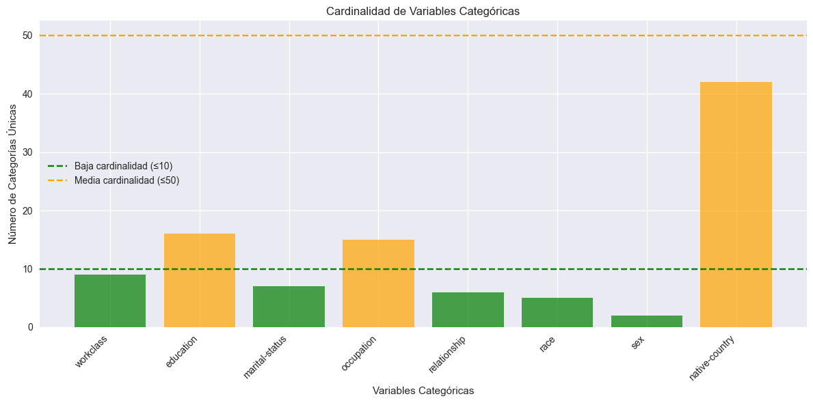
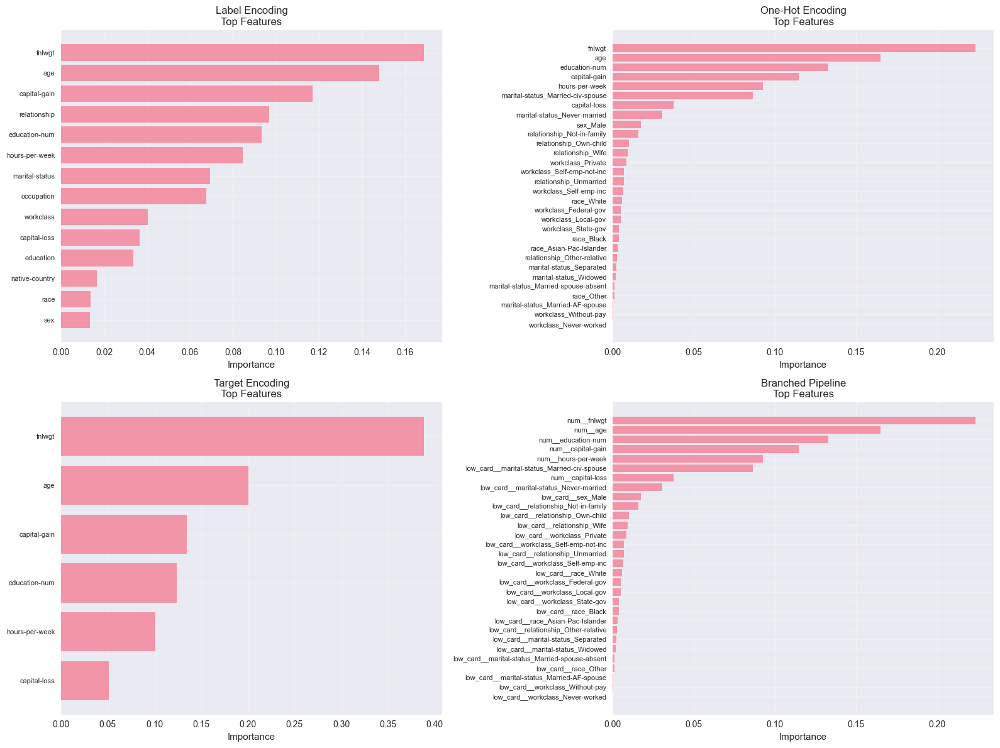
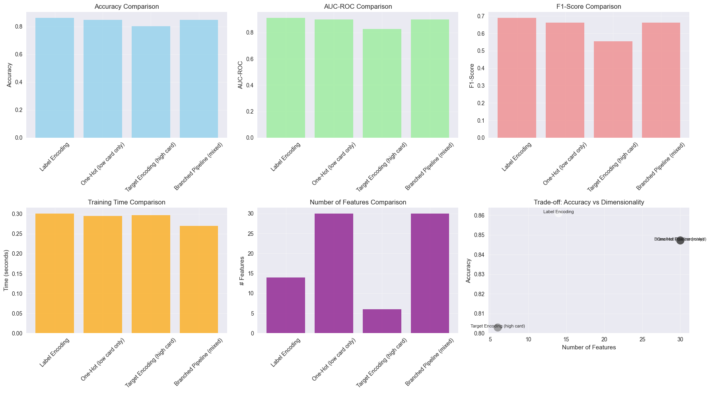
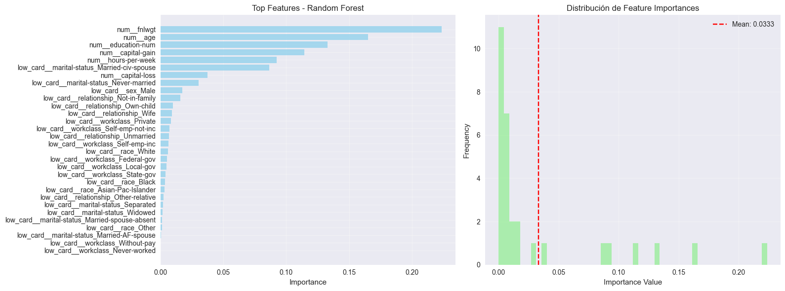
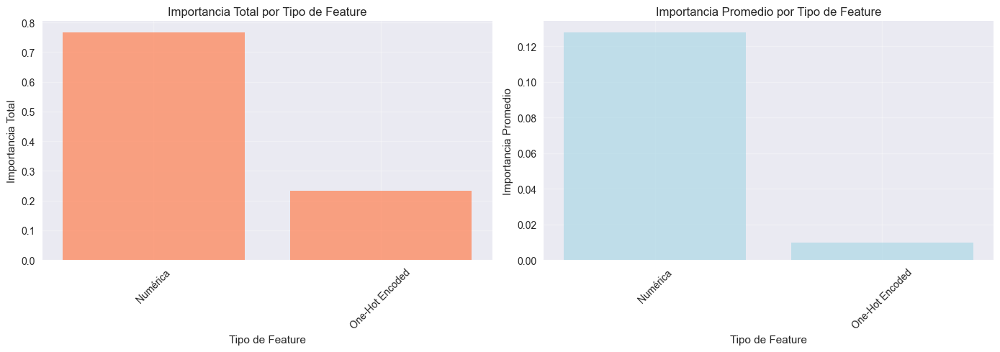

# 🧩 Encoding Avanzado — Adult Income (Census)

---

# 🌍 Contexto

Esta práctica forma parte de la **Unidad Temática 3: Feature Engineering** y está enfocada en **comparar codificadores categóricos** y su impacto en el rendimiento, la dimensionalidad y la interpretabilidad de modelos de *Machine Learning*.  
Se trabajó con el dataset **Adult Income (US Census, 1994)** para predecir si el ingreso anual es **>50K**. El énfasis estuvo en **seleccionar el encoding adecuado según la cardinalidad** y en **evitar *data leakage*** en técnicas guiadas por el target.

---

# 🎯 Objetivos

- Diagnosticar **cardinalidad** y riesgos de **explosión dimensional**.
- Implementar y evaluar **Label, One-Hot, Target** y **pipelines ramificados** con `ColumnTransformer`.
- Medir **Accuracy, AUC-ROC, F1, tiempo y #features** como criterios de decisión.
- Analizar **feature importance** y discutir **impacto ético/interpretabilidad**.
- Explorar variantes: **Frequency, Ordinal, Leave-One-Out, Binary** y **smoothing**.

---

# 📦 Dataset

| Aspecto | Descripción |
|---|---|
| **Fuente** | UCI ML Repository — Adult (Census Income) |
| **Tarea** | Clasificación binaria (`target`: `income >50K`) |
| **Tamaño** | 32 561 registros, 16 columnas (8 categóricas, 6 numéricas + 2 auxiliares) |
| **Cardinalidad** | Baja: `workclass`, `marital-status`, `relationship`, `race`, `sex` · Media: `education` (16), `occupation` (15), `native-country` (42) · Alta (>50): **ninguna** |
| **Nota** | Se limpió espacios en categorías, se creó `target` y se estratificó el *split*. |

---

# 🧹 Limpieza y preparación

1. **Carga + limpieza:** `strip()` en categóricas, remover filas con `?`.  
2. **Target binario:** `target = (income == '>50K').astype(int)`.  
3. **Selección numéricas:** `age`, `fnlwgt`, `education-num`, `capital-gain`, `capital-loss`, `hours-per-week`.  
4. **Diagnóstico de cardinalidad:** riesgo de **one-hot = 11.8×** columnas si se aplicara a todas.

---

# 🔍 Análisis de cardinalidad

**Figura 1.** Diagnóstico de cardinalidad por variable. Se observa que la mayoría de las columnas son de baja cardinalidad (≤10), aunque `education`, `occupation` y `native-country` se ubican en rango medio (11–50), lo que justifica usar encodings distintos según el tipo.

> **Conclusión:** aplicar *One-Hot* a todas las categóricas no es viable. Se optó por:  
> - *Label Encoding* para comparativa base,  
> - *One-Hot* para baja cardinalidad,  
> - *Target Encoding* para media/alta cardinalidad (en datasets futuros),  
> - y una *Pipeline Ramificada* que combine estos enfoques.

---

# 🧪 Experimentos

## 1) Label Encoding (todas las categóricas)
- **Modelo:** `RandomForestClassifier(100)`  
- **Resultados:**  
  - **Accuracy:** **0.8632** · **AUC:** **0.9101** · **F1:** **0.6931**  
  - **Tiempo:** 0.45 s · **#Features:** 14

## 2) One‑Hot (solo baja cardinalidad)
- Categóricas: `['workclass','marital-status','relationship','race','sex']`  
- **Resultados:** Accuracy 0.8483 · AUC 0.8995 · F1 0.6633 · Tiempo 0.43 s · **#Features:** 30

## 3) Target Encoding (alta/mediana cardinalidad)
- En este *split* no hubo columnas >50; se evaluó *target* para referencia.  
- **Resultados:** Accuracy 0.8021 · AUC 0.8272 · F1 0.5538 · Tiempo 0.43 s · **#Features:** 6

## 4) Pipeline ramificado (ColumnTransformer)
- **Ramas:** One‑Hot(baja) + Target(alta, 0 en este caso) + `StandardScaler`(numéricas).  
- **Resultados:** Accuracy 0.8485 · AUC 0.8996 · F1 0.6646 · Tiempo 0.44 s · **#Features:** 30

---

# 📊 Comparación de métodos

| Encoding | Accuracy | AUC-ROC | F1-Score | Tiempo (s) | #Features |
|---|---:|---:|---:|---:|---:|
| **Label Encoding** | **0.8632** | **0.9101** | **0.6931** | 0.45 | **14** |
| One‑Hot (low card) | 0.8483 | 0.8995 | 0.6633 | 0.43 | 30 |
| Target (high card) | 0.8021 | 0.8272 | 0.5538 | **0.43** | **6** |
| Branched Pipeline | 0.8485 | 0.8996 | 0.6646 | 0.44 | 30 |

**Figura 2.** Comparación de los cuatro esquemas de codificación (Label, One-Hot, Target y Pipeline Ramificado). Se observa que Label Encoding logra el mejor equilibrio entre rendimiento y complejidad, mientras que One-Hot y Pipeline aumentan la dimensionalidad sin mejoras notables.

**Figura 3.** Comparación visual de métricas y trade-offs. Label Encoding y Pipeline mantienen alta exactitud con tiempos bajos. Target Encoding reduce la dimensionalidad, pero sacrifica rendimiento global.

---

# 🔍 Explicabilidad — Feature Importance (Pipeline)

**Figura 4.** Variables más relevantes según el modelo Random Forest. `fnlwgt`, `age`, `education-num`, `capital-gain` y `hours-per-week` lideran la predicción, mientras que algunas categóricas *one-hot* (`marital-status_Married-civ-spouse`, `sex_Male`, `workclass_Private`) aportan contexto adicional.

**Importancia por tipo de feature:**
- **Numéricas:** 76.7 % del total (6 variables).  
- **One-Hot:** 23.3 % (24 variables).  
> Esto muestra que la **estructura cuantitativa del censo domina** la predicción del ingreso, aunque las categóricas ayudan a refinar segmentos sociales.

**Figura 5.** Comparación de la importancia total y promedio por tipo de variable. Las numéricas dominan tanto en peso total como en relevancia promedio; las categóricas aportan granularidad, pero con menor influencia individual.

---

# 🧪 Desafíos y variantes adicionales

- **Frequency(native-country):** Acc 0.8081 · AUC 0.8311 · F1 0.5645 · 7 feats.  
  - Útil, bajo riesgo si se calcula **solo en train**.  
- **Ordinal(education):** Acc 0.8019 · AUC 0.8272 · F1 0.5546 · 7 feats.  
  - Preserva orden; beneficia a árboles/lineales cuando hay escala.  
- **LOO(native-country):** Acc 0.7640 · AUC 0.6732 · F1 0.0576 · 7 feats.  
  - Reduce fuga usando media que **excluye** el propio registro; aquí no rindió.  
- **Binary(native-country):** Acc 0.8062 · AUC 0.8315 · F1 0.5572 · 12 feats (≈log₂ 42 ≈ 6 bits).  
  - Compacta alta cardinalidad sin usar el target.  
- **Target smoothing:** `s∈(1, 10, 100, 1000)` → AUC ≈ 0.828–0.832; **s=100** levemente mejor.  
  - `s` interpola media global ↔ media por categoría; alto `s` estabiliza clases raras.

---

# 🧠 Resultados y discusión

| Hallazgo | Implicación |
|-----------|-------------|
| **Label Encoding** domina en métricas con baja dimensionalidad | Recomendado con **modelos de árboles** cuando no hay cardinalidades extremas. |
| **One-Hot (baja)** y **Pipeline (mixto)** logran rendimientos similares | La expansión de columnas **no mejora el rendimiento**, solo la interpretabilidad. |
| **Target/LOO** no superaron alternativas | Útiles en **alta cardinalidad** o con regularización/CV; no aplican en este dataset. |
| **Predictores numéricos** concentran la mayor explicación | La carga horaria, capital y edad son las variables que más condicionan el ingreso. |

---

# 🔗 Conexión con otras unidades

- **UT1 (EDA):** el diagnóstico de cardinalidad y leakage nace del análisis exploratorio.  
- **UT2 (Calidad & Ética):** fairness: evitar que el modelo refuerce sesgos (sexo/estado civil).  
- **UT4 (Especiales):** pipelines reproducibles y escalables; *deploy* sin fugas.  

---

# 🧩 Reflexión final

El tipo de encoding **define el espacio de hipótesis del modelo**.  
En este caso, **árboles + Label Encoding** ofrecieron el mejor rendimiento con bajo costo computacional, mientras que *One-Hot* y *Target* solo justifican su uso ante cardinalidades extremas.  

Comprendí que elegir el encoding correcto no es solo una decisión técnica, sino también ética: debe garantizar **equidad, interpretabilidad y reproducibilidad**.  
En producción, optaría por un **`ColumnTransformer` ramificado**, activando la rama *target* solo si aparecen variables de alta cardinalidad y monitoreando métricas de equidad.

---

# 🧰 Stack técnico

Python · pandas · NumPy · scikit‑learn · category_encoders · matplotlib  
**Conceptos:** cardinalidad, *data leakage*, *target smoothing*, pipelines, *feature importance*

---

# Evidencias

### 📝 [Notebook](../../../notebooks/UT3-2.ipynb)

---

# 📚 Referencias

- Práctica: <https://juanfkurucz.com/ucu-id/ut3/09-encoding-avanzado-assignment/>  
- UCI Adult: Dua, D. & Graff, C. (2019). *UCI ML Repository* — Adult.  
- Scikit‑learn: *ColumnTransformer*, *Pipelines*, *OneHotEncoder*.  
- `category_encoders`: *Target*, *Binary* encoders.