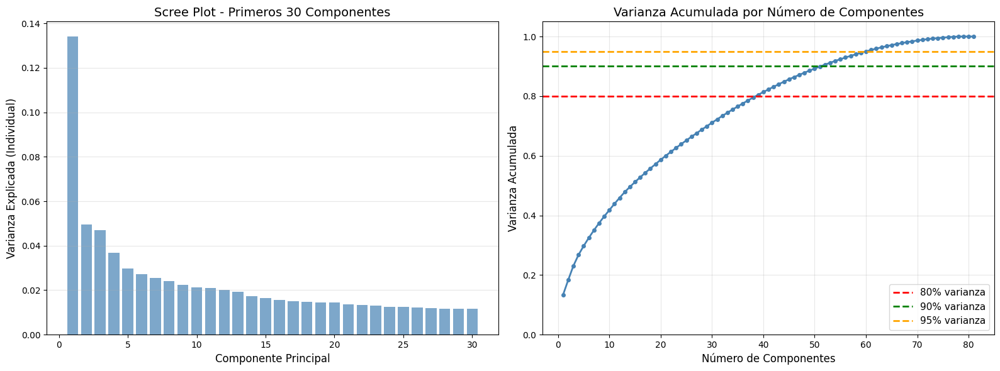
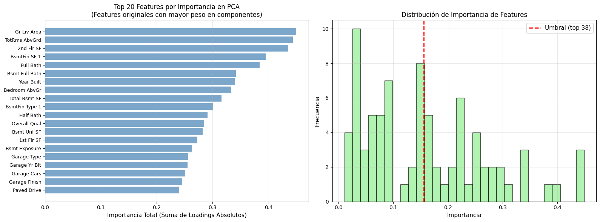
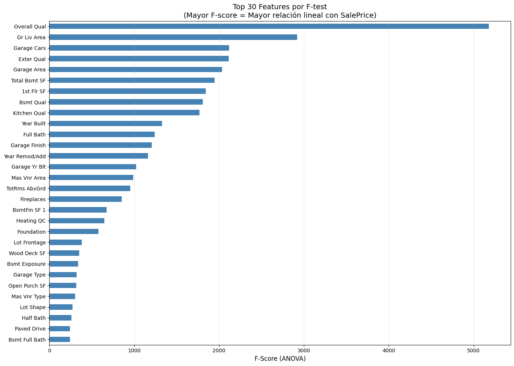
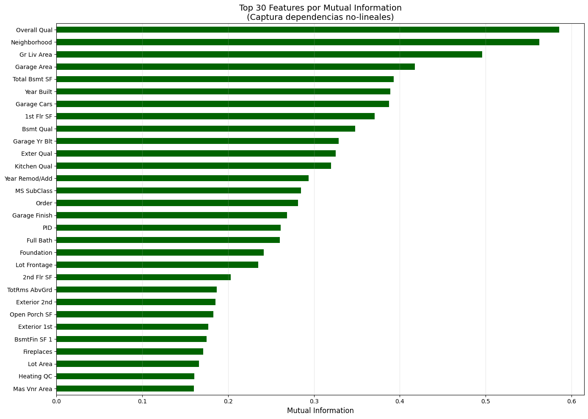
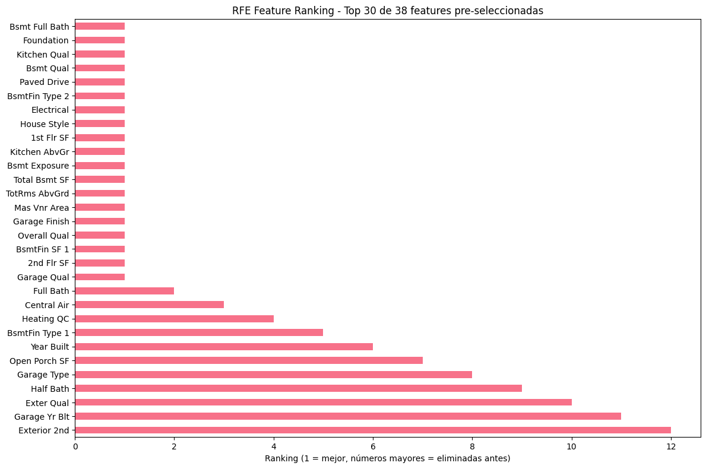
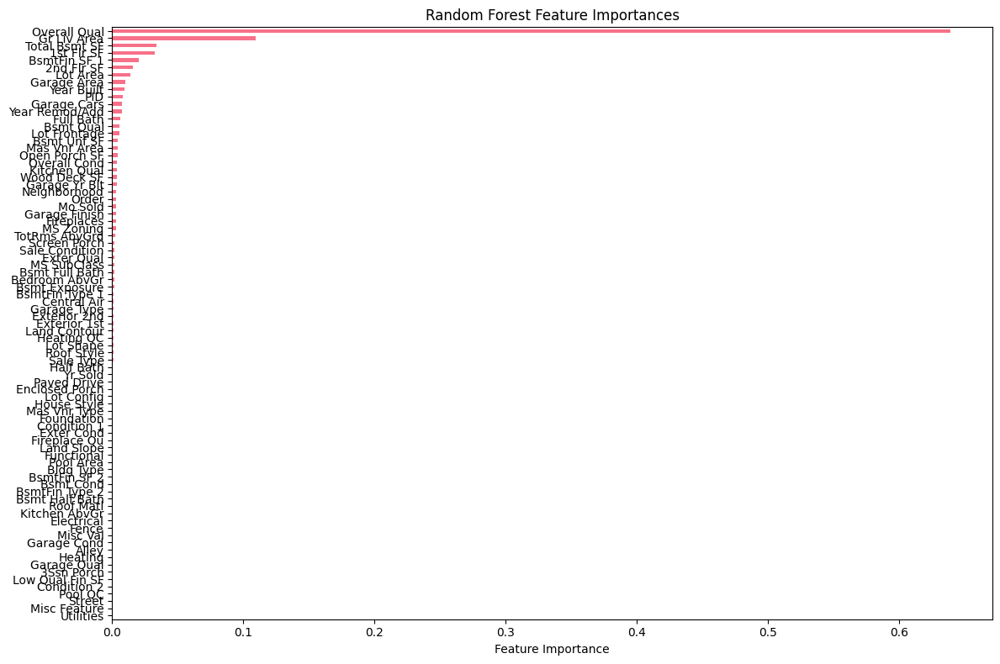
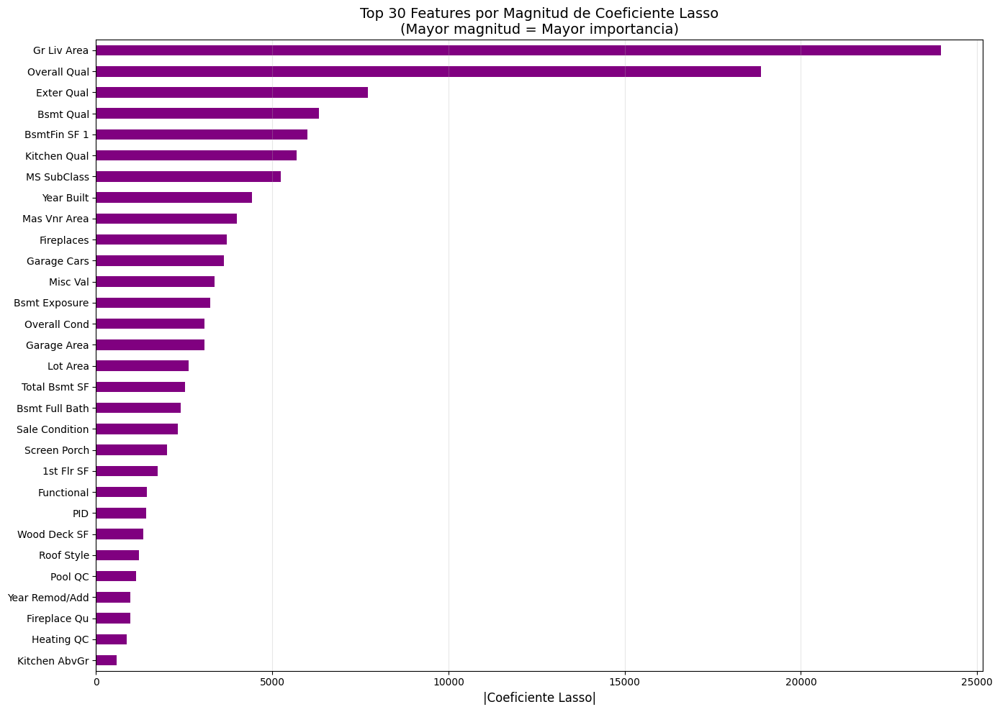
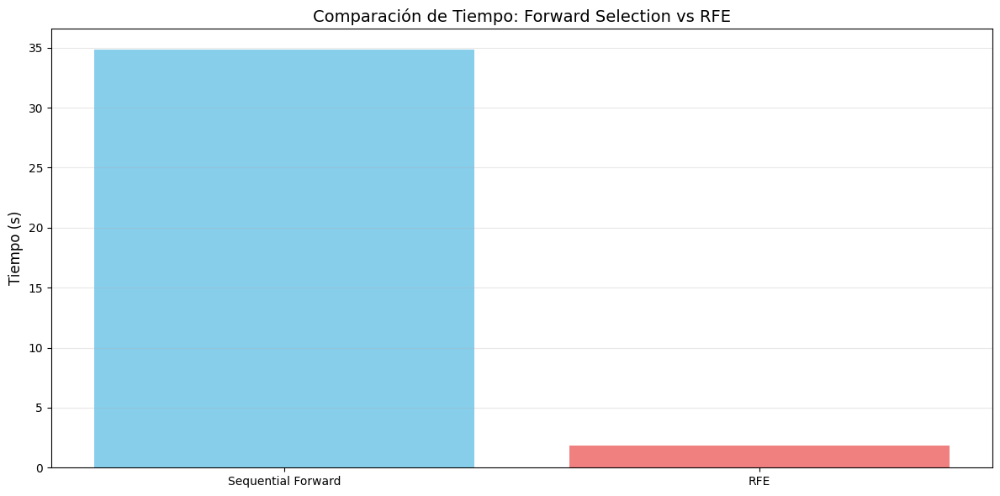

# 🔎 PCA vs Feature Selection en Ames Housing

---

# 🌍 Contexto

Esta práctica corresponde a la **Unidad Temática 3: Feature Engineering y Selección de Variables**, dentro del Portafolio de Ingeniería de Datos.  
Se trabajó con el dataset **Ames Housing** (competencia *House Prices* de Kaggle), un clásico problema de regresión donde el objetivo es predecir `SalePrice`.  

El foco estuvo en comparar dos estrategias frente a la alta dimensionalidad:
- **Reducción de dimensionalidad** mediante **PCA** (transformación de componentes principales).  
- **Selección de variables** (*Feature Selection*) en sus tres enfoques: *Filter*, *Wrapper* y *Embedded*.  

> La meta fue entender **cuándo conviene proyectar (PCA)** y **cuándo conviene elegir (FS)**, y cómo cada enfoque impacta en el **rendimiento, interpretabilidad y costo computacional**.

---

# 🎯 Objetivos

- Aplicar **PCA** y determinar el número óptimo de componentes según la varianza acumulada.  
- Implementar **métodos de selección de variables**:  
  - *Filter*: `f_regression`, `mutual_info_regression`.  
  - *Wrapper*: `RFE` con `LinearRegression` o `RandomForest`.  
  - *Embedded*: `Lasso (L1)` y `RandomForest` (feature importances).  
- Evaluar el desempeño (RMSE, R²) de cada técnica.  
- Reflexionar sobre el balance entre **precisión, interpretabilidad y eficiencia**.

---

# 📦 Dataset

| Aspecto | Descripción |
|---|---|
| **Fuente** | Kaggle — *House Prices: Advanced Regression Techniques* |
| **Tarea** | Regresión (`SalePrice`) |
| **Filas/Columnas** | ~1460 × ~80 (varía según versión/limpieza) |
| **Tipos** | Numéricas y categóricas (muchas ordinales) |
| **Problemas típicos** | Valores faltantes, variables altamente correlacionadas, cardinalidad, escalas distintas |

---

# 🧹 Limpieza y preparación

1. Se eliminó la columna `Id`.  
2. Se separó `SalePrice` como variable objetivo `y`.  
3. Se imputaron valores faltantes (mediana para numéricas, moda para categóricas).  
4. Se codificaron las variables categóricas con *Label Encoding*.  
5. Se escalaron las variables con `StandardScaler` para PCA y Lasso.  

Estos pasos garantizaron consistencia y comparabilidad entre los distintos métodos.

---

# 🧩 PCA — Reducción de Dimensionalidad

El Análisis de Componentes Principales permite condensar la información de múltiples variables en un conjunto más pequeño de componentes que explican la mayor parte de la varianza.

**Figura 1.** A la izquierda se observa el *Scree Plot* (caída de la varianza individual).  
A la derecha, la varianza acumulada muestra que con **≈38 componentes** se conserva alrededor del **90%** de la información original.  

> Se seleccionaron **38 componentes principales** como punto de corte, priorizando equilibrio entre información retenida y simplicidad del modelo.

**Figura 2.** Principales variables que más peso aportan a las componentes del PCA.  
Las áreas habitables (`Gr Liv Area`, `TotRms AbvGrd`) y características de sótano y baño son las que más influyen, mostrando que las dimensiones espaciales dominan la varianza global del conjunto.

---

# 🏷️ Feature Selection — Métodos comparativos

## 1️⃣ Filter Methods

Los métodos *Filter* seleccionan variables según su relación estadística con la variable objetivo, sin depender de un modelo específico.

**Figura 3.** Ranking de variables según el **F-test (ANOVA)**. Las variables con mayor relación lineal con `SalePrice` son `Overall Qual`, `Gr Liv Area`, `Garage Cars` y `Garage Area`.

**Figura 4.** Ranking basado en **Mutual Information**, que captura dependencias no lineales. Aparecen variables de calidad (`Neighborhood`, `Bsmt Qual`, `Exter Qual`) que el F-test no detecta, mostrando su poder para relaciones más complejas.

---

## 2️⃣ Wrapper — RFE

Los métodos *Wrapper* iteran sobre combinaciones de variables para identificar subconjuntos óptimos según el rendimiento del modelo base.

**Figura 5.** Ranking de features retenidas por **RFE**. Variables como `Bsmt Full Bath`, `Foundation`, `Kitchen Qual` y `Bsmt Qual` fueron las últimas eliminadas, señalando su relevancia estructural.

> Si bien RFE logra buena precisión, su costo computacional es alto (requiere múltiples entrenamientos).

---

## 3️⃣ Embedded — Lasso y Random Forest

Los métodos *Embedded* realizan la selección dentro del propio entrenamiento del modelo.

**Figura 6.** Importancia de variables según un **Random Forest**.  
Se observa una marcada concentración de peso en `Overall Qual` y `Gr Liv Area`, confirmando su alto poder predictivo.

**Figura 7.** Magnitud de los coeficientes del modelo **Lasso (L1)**.  
Lasso actúa como un filtro automático: mantiene solo las variables más relevantes (`Gr Liv Area`, `Overall Qual`, `Exter Qual`) y reduce a cero las redundantes, simplificando la interpretación.

---

# ⏱️ Comparación de costos

**Figura 8.** Comparativa de tiempo de ejecución.  
El método **RFE** ofrece resultados precisos pero con un **costo 15× mayor** que los métodos *Filter* o *Embedded* (como Lasso).  
En contextos de producción, la elección depende del balance entre **tiempo disponible** y **necesidad de precisión**.

---

# 📊 Resultados y discusión

> **Tabla final — mejores casos de cada bloque**

| Método | k / α | Modelo | RMSE | R² | Notas |
|---|---:|---|---:|---:|---|
| **PCA** | 38 | LR | 26 620 | 0.8859 | PCs ≥80 % var. (79.5 % retenida) |
| **Filter (MI)** | 38 | LR | 26 279 | 0.8891 | Captura relaciones no lineales, rápido y sólido |
| **Wrapper (RFE-LR)** | 19 | LR | — | — | Refinado iterativo; costo alto, mejora marginal |
| **Embedded (Lasso)** | α = 1375.38 | LR | 26 083 | 0.8908 | Sparse + interpretable; mejor rendimiento global |
| **Embedded (RF)** | 38 | LR | 26 238 | 0.8894 | Importancias útiles para ranking no lineal |

> 🏁 **Gana Lasso con 41→38 features:**  
> **RMSE = 26 083**, **R² = 0.8908**.  
> Lo elijo porque mantiene **interpretabilidad**, **baja dimensionalidad** y **supera a PCA** en un set con variables categóricas codificadas.

---

# 🔗 Conexión con otras unidades

- **UT2:** La selección de features mostró qué variables son realmente confiables antes de modelar.  
- **UT4:** Se consolidó un pipeline reproducible, con pasos ordenados y sin fuga de datos.  
- **UT5:** Se evaluó el costo/beneficio entre complejidad computacional e interpretabilidad del modelo.

---

# 🧩 Reflexión final

El trabajo confirmó que **PCA y Feature Selection no son competidores, sino herramientas complementarias.**  
Mientras PCA prioriza **compresión y estabilidad**, los métodos de selección permiten **explicabilidad y control del modelo**.  

El **Lasso** resultó la mejor opción para el caso Ames: redujo la dimensionalidad de forma natural, manteniendo las variables más significativas y logrando el menor RMSE.  
En entornos productivos, recomendaría **Lasso o Mutual Information** como estrategias base, combinadas con un pipeline que prevenga fugas de datos y preserve interpretabilidad.

---

# 🧰 Stack técnico

**Lenguaje:** Python  
**Librerías:** Pandas · NumPy · Scikit-learn · Matplotlib/Seaborn  
**Conceptos:** PCA · Filter/Wrapper/Embedded FS · RMSE/R² · Estándar de evaluación

---

# Evidencias

### 📝 [Notebook](../../../notebooks/UT3-3.ipynb)

---

# 📚 Referencias

- Guía UT3-10 — PCA & Feature Selection (UCU-ID): <https://juanfkurucz.com/ucu-id/ut3/10-pca-feature-selection/>  
- Scikit-learn: PCA, SelectKBest, RFE, Lasso, RandomForest.  
- Kaggle — *House Prices: Advanced Regression Techniques*.