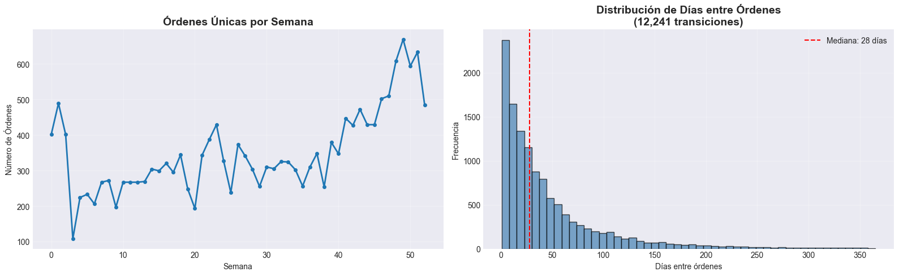
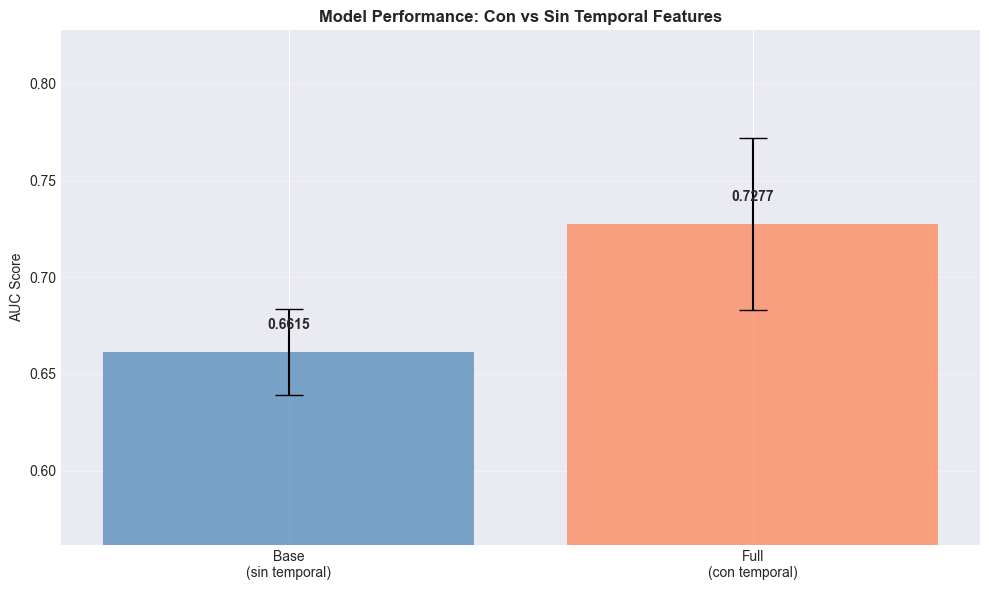
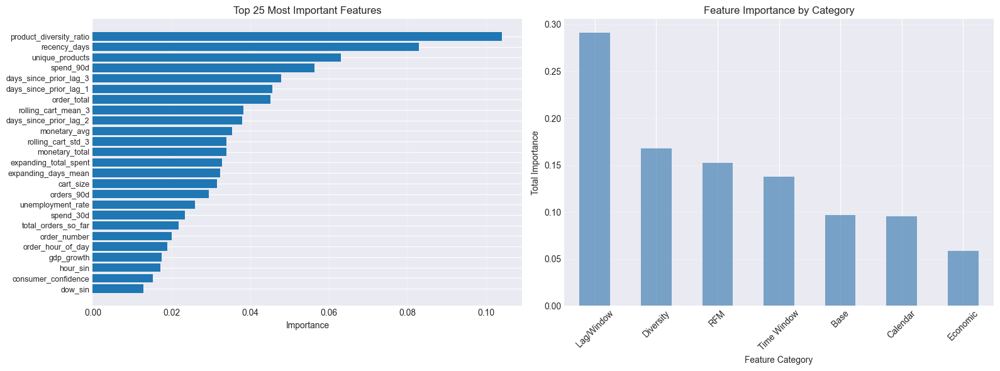

# ⏱️ Temporal Feature Engineering con Pandas

---

# 🌍 Contexto

Esta práctica de la **Unidad Temática 3 (Feature Engineering)** trabaja **datos transaccionales de e‑commerce** para construir **features temporales** con `pandas` evitando **data leakage**. El foco está en: **lags**, **rolling/expanding windows**, **agregaciones por usuario**, **features cíclicas**, **variables externas** y **validación temporal**.

> Regla de oro: **ordenar por tiempo y agrupar por usuario** antes de calcular cualquier feature temporal.

---

# 🎯 Objetivos

- Implementar **lag features** con `.groupby().shift()` (sin leakage).
- Calcular **rolling** y **expanding** windows con exclusión explícita del presente.
- Armar **RFM** (Recency, Frequency, Monetary) y **agregaciones por usuario**.
- Agregar **calendar features** con **encoding cíclico** (sin/cos) y **variables externas** simuladas.
- Diseñar **validación basada en tiempo** (`TimeSeriesSplit`) y comparar **modelo base vs. temporal**.
- Redactar **conclusiones** y **chequeos de leakage**.

---

# 📦 Dataset

| Aspecto | Descripción |
|---|---|
| **Fuente** | Kaggle — *Online Retail (2010–2011)* |
| **Archivo** | `OnlineRetail.csv` |
| **Estructura** | Transacciones (eventos irregulares, muchas órdenes por usuario) |
| **Target** | `will_purchase_again`: indica si el usuario realiza una orden posterior. |

> Nota: Aceptá el dataset en Kaggle (join/accept) antes de descargar con API.

**Figura 1.** A la izquierda se observa la cantidad de órdenes únicas por semana.  
A la derecha, la distribución de días entre órdenes, con una **mediana cercana a 28 días**, lo que justifica la creación de *lags* y ventanas de 7, 30 y 90 días.

---

# 🔧 Metodología general

El proceso se estructuró en **siete etapas**, construyendo un pipeline reproducible:

1. **Limpieza:** se eliminaron órdenes canceladas, precios y cantidades no válidos, y se tipificaron fechas.  
2. **Nivel de orden:** se agregaron `cart_size` (tamaño del carrito) y `order_total` (gasto total).  
3. **Lags:** se calcularon variables `days_since_prior_lag_{1..3}` mediante `.shift()` agrupando por usuario.  
4. **Rolling / Expanding:** medias, desviaciones y sumas históricas, siempre desplazadas una fila para evitar mirar al presente.  
5. **RFM + Ventanas:** métricas de recencia, frecuencia y gasto, además de ventanas de 7/30/90 días (`orders_7d`, `spend_90d`, etc.).  
6. **Calendario y cíclicas:** variables de día, hora y mes transformadas con seno/coseno, junto con feriados del Reino Unido.  
7. **Externas:** variables económicas mensuales simuladas (`gdp_growth`, `unemployment_rate`, `confidence`), propagadas hacia adelante (*forward fill*) para evitar fugas temporales.

> El modelo base fue un **RandomForestClassifier** (`n_estimators=100`, `max_depth=10`, `random_state=42`).

---

# ⚖️ Resultados: modelo base vs modelo temporal

**Figura 2.** Comparación de AUC promedio entre modelos.  
El modelo con features temporales alcanzó un **AUC de 0.7277**, frente a **0.6615** del modelo base, lo que representa una **mejora del 10%**.  
Esta diferencia confirma que las variables derivadas del tiempo aportan señal predictiva real.

---

# 🔍 Variables más relevantes

**Figura 3.** A la izquierda, las 25 variables más importantes según el modelo.  
A la derecha, la importancia acumulada por categoría.  
Destacan las **lags y ventanas móviles**, seguidas por las de **RFM** y **diversidad de productos**.  
Las variables de calendario y las externas económicas tuvieron menor impacto, aunque ayudaron a capturar estacionalidad.

---

# ✅ Prevención de leakage

Para garantizar que el modelo no accediera a datos del futuro:

- Todas las agregaciones históricas se realizaron con **`.shift(1)`**.  
- Las **ventanas móviles y acumulativas** excluyen el registro actual.  
- Las **variables externas** usan solo información previa (relleno hacia adelante).  
- Se utilizó **`TimeSeriesSplit`** para validar respetando el orden cronológico.

---

# 🧠 Resultados y discusión

| Hallazgo | Lectura |
|---|---|
| **AUC +0.066** | Las features temporales aportan señal real de recompra. |
| **Horizonte** | Las ventanas **de 90 días** son más informativas que 7/30. |
| **Categorías** | **Lag/Window > RFM > Diversidad > Calendario/Económicas**. |
| **Robustez** | Gap train–CV razonable, sin indicios de fuga. |

> En un entorno productivo, implementaría un **pipeline diario** que regenere features solo con datos hasta la fecha de corte.  
> Para futuras versiones, extendería con **Fourier features** para estacionalidad, **tendencias (slopes)** y validaciones tipo **walk-forward**.

---

# 🔗 Conexión con otras unidades

- **UT2:** Reforcé la importancia de datos limpios y consistentes en el tiempo antes de cualquier modelado.  
- **UT4:** Este ejercicio anticipa cómo construir pipelines de ETL reproducibles, donde las ventanas y agregaciones se regeneran automáticamente cada día.  
- **UT5:** Las métricas (AUC y mejora del 10%) se vinculan con objetivos de negocio como retención y predicción de churn.

---

# 🧩 Reflexión final

Este ejercicio me ayudó a entender que las **features temporales son las más poderosas** para describir el comportamiento dinámico de los usuarios.  
Las *lags* permiten detectar patrones de repetición, las *rolling windows* suavizan fluctuaciones y las métricas *RFM* resumen la historia de cada cliente.

Más allá del rendimiento, aprendí la importancia de **respetar la secuencia temporal** y diseñar pipelines que sean **seguros frente a leakage**.  
El equilibrio entre información útil y costo computacional es clave: las ventanas amplias son costosas, pero ofrecen una lectura más profunda del comportamiento.

---

# 🧰 Stack técnico

**Python** · Pandas · NumPy · Scikit-learn · Matplotlib/Seaborn  
**Conceptos:** Lags · Rolling/Expanding · RFM · Ventanas 7/30/90d · Encoding cíclico · `TimeSeriesSplit` · Leakage Prevention

---

# Evidencias

### 📝 [Notebook](../../../notebooks/UT3-4.ipynb)

---

# 📚 Referencias

- Práctica: <https://juanfkurucz.com/ucu-id/ut3/11-temporal-features-assignment/> 
- Kaggle API — https://www.kaggle.com/docs/api  
- Pandas Time Series — https://pandas.pydata.org/docs/user_guide/timeseries.html  
- TimeSeriesSplit — https://scikit-learn.org/stable/modules/generated/sklearn.model_selection.TimeSeriesSplit.html  
- RandomForestClassifier — https://scikit-learn.org/stable/modules/generated/sklearn.ensemble.RandomForestClassifier.html
