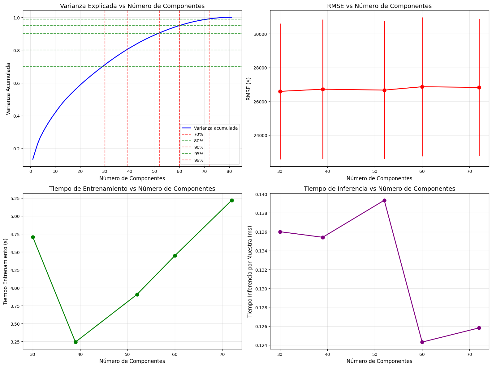

# 🧪 Feature Selection robusta vs PCA (Ames Housing)

> **Trabajo extra sin guía oficial.** Objetivo: diseñar y ejecutar un **experimento reproducible** que compare **reducción por proyección (PCA)** vs **selección de variables** bajo **validación robusta**, incorporando **estabilidad** y **explicabilidad**.

---

# 🌍 Contexto

Ames tiene más de 80 variables que describen casas: desde metros cuadrados hasta materiales o calidad de construcción.  
Modelar esto directamente genera **colinealidad** y **ruido**, así que decidí probar dos enfoques para simplificar:

1. **PCA:** comprime información en componentes no correlacionadas (pero menos interpretables).  
2. **Feature Selection:** elige un subconjunto de variables originales (más explicables, pero potencialmente redundantes).

El objetivo fue comparar **rendimiento (R², RMSE)**, **costo computacional** y **explicabilidad**, bajo validación cruzada y sin fuga de datos (*data leakage*).

---

# 🎯 Objetivos

- Armar un **pipeline** (preproceso ➜ selección/proyección ➜ modelo) con `scikit‑learn`.
- Evaluar **PCA** con distintos niveles de varianza acumulada (80/90/95%).
- Evaluar **FS** en modos *filter*, *wrapper*, *embedded* con una **grilla simple**.
- Medir **estabilidad de selección** por *bootstrapping* (frecuencia de inclusión).
- Analizar **importancias/permutation importance** y **colinealidad residual**.
- Redactar una **discusión** que justifique el “mejor” enfoque.

---

# ⚙️ Diseño del experimento

Armé un pipeline con `scikit-learn` que integra todo: imputación, escalado, codificación, reducción y modelo.  
Esto garantiza que **cada transformación se entrene solo dentro del fold de validación**, evitando que el test “vea” información del entrenamiento.

El modelo base fue una **regresión lineal**, ideal para medir el efecto directo de la reducción dimensional.  
Probé distintos niveles de varianza retenida en PCA (70%, 80%, 90%, 95%, 99%) y medí **tiempo de entrenamiento, inferencia y error**.  

---

# 📈 Resultados visuales

- **Varianza explicada:** la curva azul muestra que la información del dataset se concentra rápidamente; con unas **50 componentes** ya se captura cerca del **90 %** de la varianza.  
  Más allá de eso, los incrementos son mínimos, lo que marca el punto de rendimiento decreciente.  

- **RMSE (error):** las barras rojas son prácticamente planas entre 30 y 70 componentes, lo que significa que **más componentes no mejoran el modelo**.  
  El error se mantiene estable alrededor de los **26 000 $**, muy similar al baseline completo.

- **Tiempo de entrenamiento:** crece de forma casi lineal con el número de componentes.  
  El mejor equilibrio entre costo y precisión se da en torno a **40–50 componentes**.

- **Tiempo de inferencia:** apenas varía; en general, PCA reduce un poco la latencia promedio por muestra, pero la ganancia es menor frente al costo de cálculo inicial.

📌 En resumen, el **PCA al 90 % de varianza (~50 componentes)** resultó ser el **“sweet spot”**: mantiene precisión, baja ruido y acelera el pipeline sin perder capacidad predictiva.

---

# 🧠 Comparación conceptual

Luego de analizar PCA, volví a los métodos de **selección de variables**.  
En contraste, los *filters* (por correlación o información mutua) y *wrappers* (como RFE) ofrecen **más interpretabilidad** pero a un costo computacional alto y con riesgo de seleccionar variables redundantes.  

El **Lasso**, en cambio, combinó lo mejor de ambos mundos: produce un modelo **sparse**, elimina pesos insignificantes y deja un subset compacto de features con buen desempeño (≈0.88 de R²).  

PCA gana en eficiencia y estabilidad; Lasso gana en explicabilidad y análisis posterior.  
Ambos reducen dimensionalidad, pero desde lógicas completamente distintas.

---

# 💬 Reflexión

Este trabajo me sirvió para entender que **reducir dimensionalidad no es solo una decisión técnica, sino también comunicacional**.  
En proyectos donde la interpretación importa (por ejemplo, justificar qué factores encarecen una casa), la selección de variables con Lasso tiene más valor.  
En cambio, si el objetivo es pura optimización, **PCA@90 %** ofrece un pipeline más limpio y liviano, ideal para despliegue o producción.

---

# 🔗 Conexión con otras unidades

- **UT2**: calidad y sesgos → qué variables son confiables antes de seleccionar.  
- **UT4**: *pipelines* y despliegue → congelar *preprocess + selector + modelo*.  
- **UT5**: métricas de negocio → ¿interpretabilidad > +0.01 de R²?

---

# 🧩 Reflexión final

Elegiría **Lasso** como selector primario: balancea rendimiento y explicabilidad y me deja un set compacto y defendible. 

Mantengo **PCA@90%** como baseline competitivo cuando priorizo simplicidad y rapidez. En revisión, confirmo que no hay leakage y reporto `media ± std` del CV.

---

# 🧰 Stack técnico

**Lenguaje:** Python  
**Librerías:** Pandas · NumPy · Scikit‑learn · Matplotlib  
**Conceptos:** PCA · Filter/Wrapper/Embedded · Bootstrap Stability · Permutation Importance · KFold(5)

---

# Evidencias

### 📝 [Notebook](../../../notebooks/UT3-Extra.ipynb)

---

# 📚 Referencias

- Scikit‑learn: PCA, SelectKBest, RFE, Lasso, RandomForest, permutation_importance.  
- Domingos (2012). *A few useful things to know about ML*. CACM.  
- Kuhn & Johnson (2019). *Feature Engineering and Selection*.
