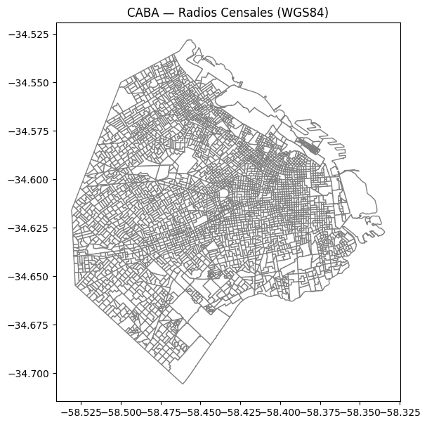
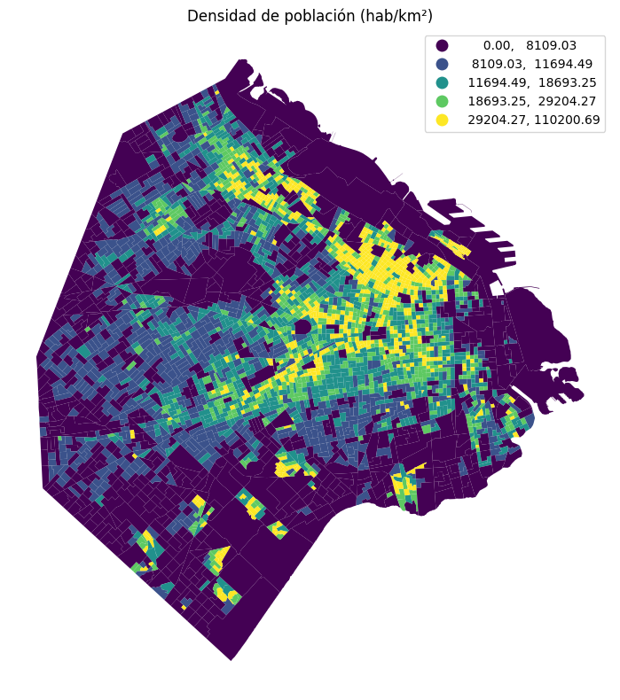
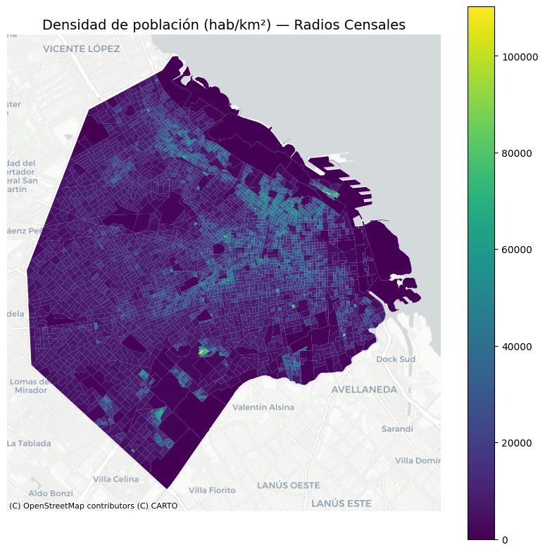
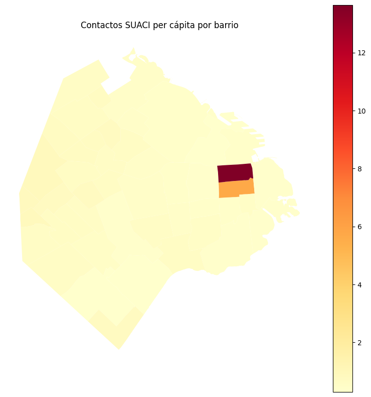
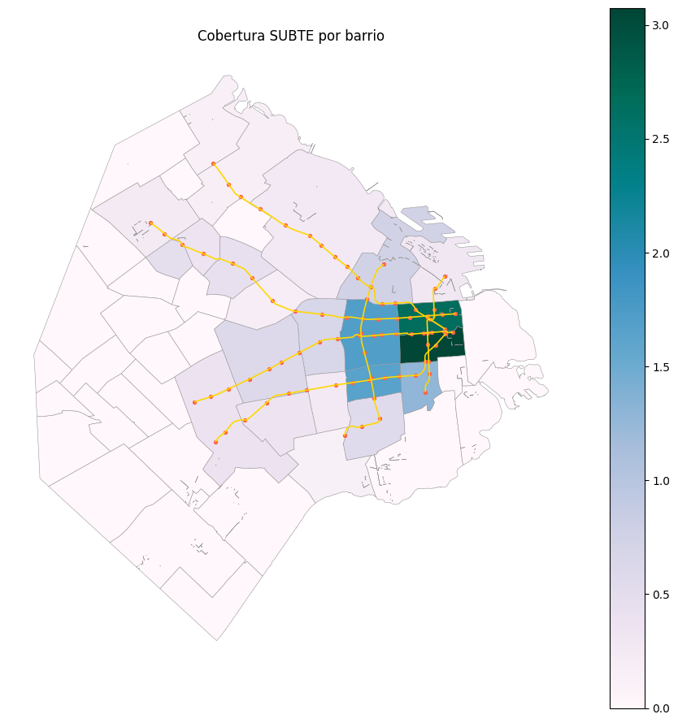

# 🌎 Análisis Geoespacial en CABA  

---

# 🌍 Contexto

Esta actividad pertenece a la **Unidad Temática 4: Geoespacial**, donde se introduce el trabajo con datos geográficos en Python utilizando **GeoPandas**, **Shapely**, **Contextily** y métodos de análisis espacial.  

El caso de estudio es la Ciudad Autónoma de Buenos Aires (CABA).  
A partir de datos censales, capas de barrios y equipamiento urbano, se realizaron tareas de:

- carga y exploración de capas geográficas,  
- reproyección entre sistemas de coordenadas (WGS84 ↔ metros),  
- cálculo de áreas, distancias y uniones espaciales,  
- generación de mapas temáticos,  
- análisis de accesibilidad mediante *distance to nearest*.

Esta práctica consolida el manejo de **modelos vectoriales**, **CRS**, *joins espaciales* y visualización geográfica.

---

# 🎯 Objetivos

- Comprender la diferencia entre **modelos vectoriales** y **raster**, y operar con geometrías en Python.  
- Manipular datos geográficos con **GeoPandas** (read, merge, plotting).  
- Reproyectar capas usando distintos **Sistemas de Referencia de Coordenadas (CRS)**.  
- Calcular **áreas en m²**, **distancias**, **buffers** y **uniones espaciales**.  
- Crear mapas temáticos con Matplotlib + Contextily.  
- Analizar la distribución espacial de población, equipamiento y cobertura de servicios.

---

# 📦 Dataset y Capas utilizadas

| Capa / Dataset | Descripción |
|----------------|-------------|
| **Radios censales de CABA** | Polígonos WGS84 con datos de población, viviendas y hogares. |
| **Barrios de CABA** | Polígonos oficiales de barrios. |
| **Contactos SUACI** | Puntos de atención vecinal por barrio. |
| **Líneas y estaciones de SUBTE** | Modelo vectorial de la red de subterráneos. |
| **Bases OpenStreetMap** | Mapas base para visualización (Contextily). |

> Los archivos fueron trabajados inicialmente en **EPSG:4326 (WGS84)** y reproyectados a **EPSG:3857** para cálculos métricos.

---

# 🗺️ Exploración inicial

Primero se visualizaron los radios censales para validar geometrías y proyección.



**Figura 1:** Radios censales en WGS84. La geometría está completa y sin topologías inválidas.

---

# 📊 Densidad de población

Se incorporó el dato de población y área, reproyectando a metros cuadrados y calculando:

\[
\text{densidad} = \frac{\text{población}}{\text{área en km}^2}
\]



**Figura 2:** Mapa coroplético de densidad.  
La mayor concentración aparece en el corredor norte–centro, coincidente con zonas de parques y avenidas principales.

---

# 🗺️ Densidad + Mapa Base (Contextily)

Se añadió un *basemap* de CARTO como referencia visual.



**Figura 3:** Densidad de población sobre mapa base.

---

# 🧮 Métricas espaciales

### 🔸 Cálculo de área  
Tras reproyectar a EPSG:3857:

```python
radios_m = radios.to_crs(3857)
radios_m["area_m2"] = radios_m.area
```

### 🔸 Uniones espaciales
Para asignar datos de SUACI y SUBTE a barrios:
```python
barrios_m = gpd.sjoin(barrios_m, suaci_m, how="left")
```

### 🔸 Distancia al punto más cercano
(Accesibilidad a centros SUACI)
```python
barrios_m = gpd.sjoin_nearest(
    barrios_m, suaci_m[["geometry"]],
    how="left",
    distance_col="dist_min_m"
)
```
> Esta columna permitió identificar los barrios con peor cobertura de centros de atención.

---

# 🗺️ Contactos SUACI per cápita



**Figura 4:** Zonas del corredor norte presentan valores atípicamente altos, lo cual puede deberse a baja población de base.

---

# 🚇 Cobertura de SUBTE

Se cargaron estaciones y líneas de SUBTE, permitiendo obtener una métrica de densidad de nodos por barrio.



**Figura 5:** Cobertura SUBTE.
Zona del microcentro y sur inmediato presenta máxima concentración de estaciones.

---

# 🧠 Resultados y discusión

| Aspecto | Hallazgo | Interpretación |
|--------|----------|----------------|
| **Densidad poblacional** | Corredor norte–centro con picos | Corresponde a tejido urbano consolidado + ejes de transporte |
| **SUACI per cápita** | Valores extremos en barrios pequeños | Poblaciones chicas → ratios inflados |
| **Cobertura SUBTE** | Fuerte centralización | Mayor accesibilidad en zonas comerciales, carencia en periferia oeste |
| **Distancia mínima a SUACI** | Permitió detectar “peores coberturas” | Insumos directos para planificación territorial |

> **Insight general:**  
> La combinación de uniones espaciales + distancias revela inequidades geográficas que no emergen de tablas tradicionales.  
> El análisis espacial aporta contexto territorial al proceso de ingeniería de datos.

---

# 🔗 Conexión con otras unidades

- **UT1:** Exploración y visualización inicial del dataset.
- **UT2:** Calidad y detección de outliers espaciales (geometrías inválidas).
- **UT3:** Generación de features geográficas para modelos posteriores.
- **UT5:** Integración de geodatos en pipelines ETL reproducibles.

---

# 🧩 Reflexión final

Aprendí a trabajar con datos geográficos desde su carga hasta su análisis métrico, entendiendo cómo las elecciones de **CRS**, los joins espaciales y las distancias afectan la calidad del análisis.

El manejo de GeoPandas abre la puerta a desarrollar **features geoespaciales** que enriquecen cualquier proyecto de machine learning, especialmente en contextos urbanos donde la accesibilidad y el territorio importan.

---

# 🧰 Stack técnico

**Lenguaje:** Python
**Librerías:** GeoPandas · Shapely · Contextily · Pandas · NumPy · Matplotlib
**Conceptos:** CRS · Reproyección · Área · Distancia · Spatial Join · Choropleth Maps

---

# Evidencias

### 📝 [Notebook](../../../notebooks/UT4-1.ipynb)

---

# 📚 Referencias

- Guía UT4 — Geoespacial: <https://juanfkurucz.com/ucu-id/ut4/12-geoespacial/>
- GeoPandas Documentation — https://geopandas.org/
- Contextily — https://contextily.readthedocs.io/
- Shapely — https://shapely.readthedocs.io/