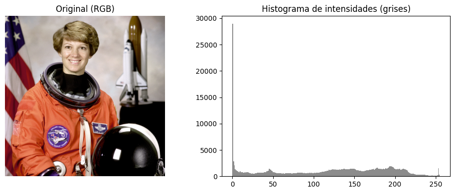
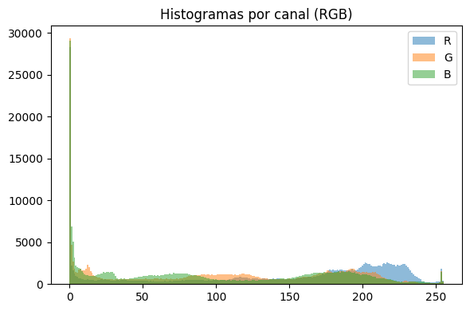
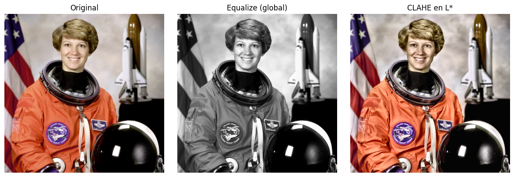
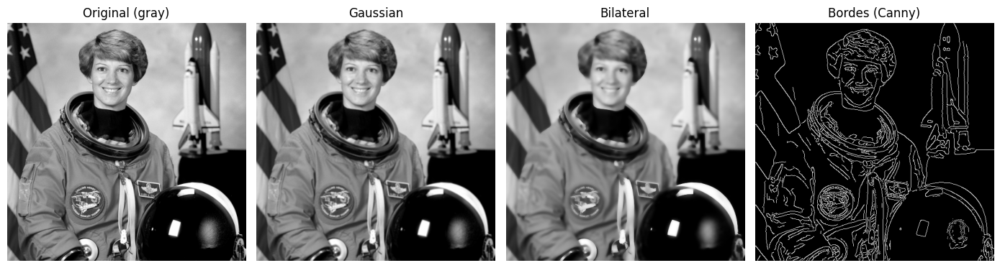
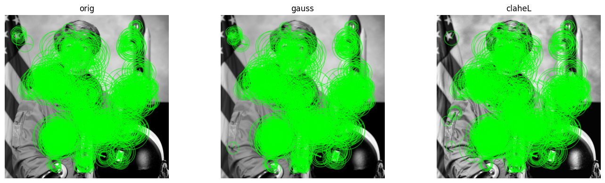
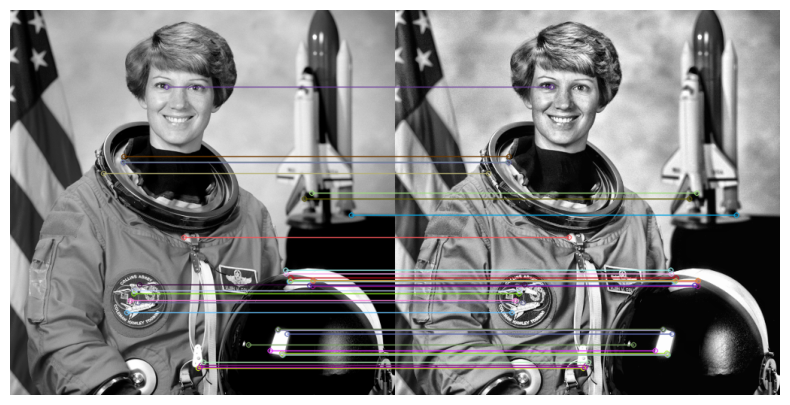

# 🖼️ Preprocesamiento de imágenes  

---

# 🌍 Contexto

Esta práctica introduce las bases del **preprocesamiento de imágenes** dentro del pipeline de Visión por Computador.  
Se trabaja con operaciones fundamentales para mejorar la calidad, corregir contraste, reducir ruido y extraer información relevante antes de pasar a modelos más complejos.

El objetivo central es entender cómo cada transformación afecta:

- la **intensidad y distribución de pixeles**,  
- la **percepción visual**,  
- la **capacidad de detectar bordes y características**,  
- y el **rendimiento de algoritmos posteriores** (matching, segmentación, clasificación).

Se trabajó con una imagen real en RGB (astronauta NASA) y se aplicaron múltiples técnicas de procesado usando **skimage** y **OpenCV**.

---

# 🎯 Objetivos

- Comprender la estructura de una imagen digital (matriz, canales, intensidades).  
- Analizar histogramas en escala de grises y por canal RGB.  
- Aplicar **ecualización global** e **histogram CLAHE**.  
- Evaluar filtros de suavizado: **Gaussian Blur** y **Bilateral Filter**.  
- Detectar bordes mediante **Canny**.  
- Identificar y comparar puntos de interés.  
- Visualizar **feature matching** entre imágenes transformadas.  
- Reflexionar sobre el rol del preprocesamiento en pipelines de visión.

---

# 📦 Dataset

| Aspecto | Descripción |
|--------|-------------|
| **Fuente** | Imagen de ejemplo NASA (RGB) incluida en `skimage.data` |
| **Resolución** | ≈ 500 × 350 px |
| **Formato** | Array NumPy (3 canales) |
| **Uso** | Preprocesamiento, histogramas, filtros, bordes, matching |

---

# 📊 Histogramas de intensidades

## 🔸 Histograma en escala de grises

**Figura 1:**  
El histograma muestra un **pico masivo en intensidades bajas**, indicando gran proporción de fondos oscuros y sombras.  
La cola larga hacia valores altos corresponde a piel, traje naranja y el transbordador.

---

## 🔸 Histogramas por canal (RGB)

**Figura 2:**  
Se observan:
- El canal **G** tiene el pico más alto en intensidades muy bajas (fondo oscuro).  
- El canal **R** domina en rango alto (el traje naranja).  
- El canal **B** es intermedio.

Esto confirma que una imagen RGB tiene comportamientos **no equivalentes** entre canales, y la elección del canal afecta todo procesamiento posterior.

---

# 🎨 Mejoras de contraste

## 🔸 Comparativa: original vs equalize vs CLAHE

**Figura 3:**

- **Equalize (global):** estira el histograma completo → mejora contraste, pero puede generar pérdida de naturalidad.  
- **CLAHE (L\*)** respeta mejor la iluminación local → produce un contraste más realista y evita saturación.

> **Conclusión:** CLAHE es superior cuando se busca mejorar contraste sin degradar la imagen.

---

# 🧼 Suavizado y bordes

## 🔸 Filtros de suavizado + Canny

**Figura 4:**

- **Gaussian:** elimina ruido, pero suaviza bordes importantes.  
- **Bilateral:** preserva bordes mientras suaviza áreas planas (ideal en rostros).  
- **Canny:** resalta bordes prominentes to detect shapes & contours.

> La calidad del mapa de bordes mejora cuando se combina con un suavizado previo (Gaussian o Bilateral).

---

# 🎯 Puntos de interés

**Figura 5:**  
Los detectores marcan regiones de alto gradiente y patrones repetitivos (pliegues del traje, casco, bandera).  
El contraste influye directamente en la cantidad y calidad de los puntos de interés.

---

# 🔗 Feature Matching

**Figura 6:**  
Comparación entre la imagen original y una versión transformada.  
Las líneas conectan puntos similares detectados por ORB/SIFT.

Hallazgos:

- CLAHE mejora la consistencia en matching.  
- El suavizado Gaussian reduce la nitidez → se pierden matches.  
- Las regiones con textura rica (casco, parches, bandera) generan matches más estables.

---

# 🧠 Resultados y discusión

| Técnica | Hallazgo | Interpretación |
|--------|----------|----------------|
| **Histogramas** | Distribución sesgada a intensidades bajas | Gran presencia de sombras y fondo oscuro |
| **Equalize** | Contraste global mejorado | Puede sobresaturar detalles |
| **CLAHE** | Contraste local optimizado | Mejor calidad visual y más estable para feature extraction |
| **Gaussian Blur** | Suavizado fuerte | Pérdida de bordes |
| **Bilateral Filter** | Suaviza preservando bordes | Ideal para prepar el Canny |
| **Canny** | Bordes fuertes bien definidos | Depende del preprocesado previo |
| **Keypoints + Matching** | CLAHE produce más matches válidos | El preprocesamiento cambia la calidad de features |

> **Insight general:**  
> El preprocesamiento no es un paso “estético”, sino funcional: determina qué información se conserva, realza o pierde.  
> Un paso mal elegido puede destruir bordes, saturar regiones o generar features poco fiables.

---

# 🔗 Conexión con otras unidades

- **UT1:** Representación de datos y EDA visual.  
- **UT2:** Relación entre ruido, calidad y preparación de datos.  
- **UT3:** Preprocesamiento como paso previo al Feature Engineering.  
- **UT4 (geoespacial):** Concepto compartido: transformar correctamente la representación antes del análisis.  
- **UT5:** Preprocesamiento como parte clave del pipeline ETL.

---

# 🧩 Reflexión final

Comprendí cómo cada técnica de preprocesamiento altera la información visual de formas distintas.  
Operaciones como CLAHE, filtros bilaterales o Canny no son decisiones arbitrarias: son herramientas que cambian qué *feature* será legible para un algoritmo posterior.

Entendí la importancia de:

- analizar histogramas antes de ecualizar,  
- elegir filtros según el objetivo (denoise, edge-preserving),  
- y validar cómo afecta al matching y a la extracción de características.

---

# 🧰 Stack técnico

**Lenguaje:** Python  
**Librerías:** NumPy · Matplotlib · scikit-image · OpenCV  
**Conceptos:** Histogramas · Equalize · CLAHE · Gaussian Blur · Bilateral Filter · Canny · Keypoints · Matching

---

# Evidencias

### 📝 [Notebook](../../../notebooks/UT4-2.ipynb)

---

# 📚 Referencias

- Práctica oficial: <https://juanfkurucz.com/ucu-id/ut4/13-preprocesamiento-imagenes/>  
- scikit-image Documentation  
- OpenCV Documentation