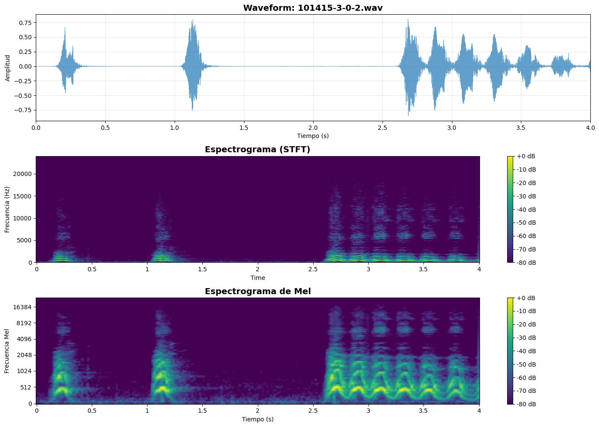
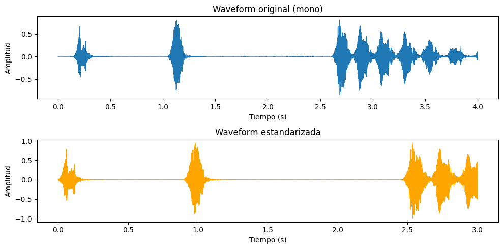
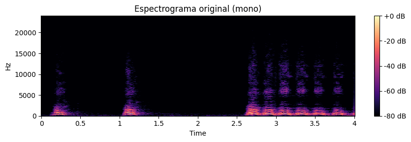
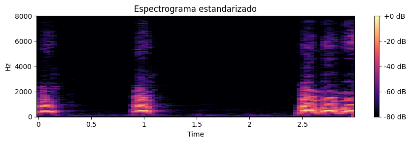
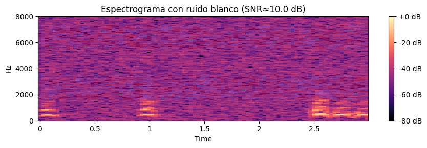
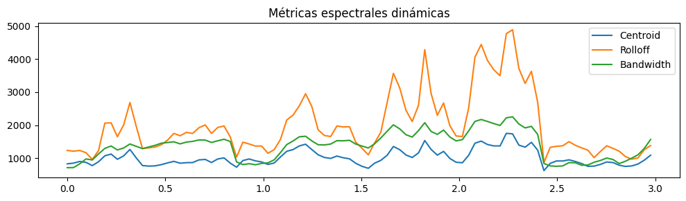
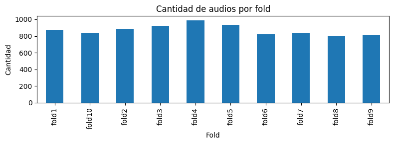
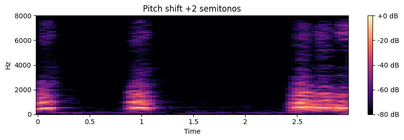
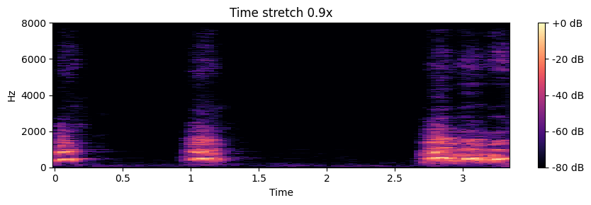

# 🔊 Preprocesamiento de Audio  

---

# 🌍 Contexto

Esta práctica pertenece a la **Unidad Temática 4: Geodatos y Señales**, en la cual se incorpora el tratamiento de **datos no tabulares**, específicamente **audio digital**.  
El objetivo central fue comprender cómo trabajar con **representaciones en el dominio del tiempo**, el **dominio de la frecuencia** y representaciones **tiempo–frecuencia** como los **espectrogramas**.

Se trabajó con un audio del dataset **UrbanSound8K**, aplicando:

- carga y visualización de waveform,  
- STFT y espectrogramas de Mel,  
- normalización y estandarización,  
- adición de ruido,  
- métricas espectrales,  
- análisis exploratorio de la distribución del dataset,  
- augmentations: *pitch shift* y *time stretch*.

Esta práctica conecta procesamiento de señales con *feature engineering* para modelos de audio.

---

# 🎯 Objetivos

- Comprender cómo se representa una señal de audio digital.  
- Construir visualizaciones en los dominios **tiempo**, **frecuencia** y **tiempo–frecuencia**.  
- Aplicar **preprocesamiento**: normalización, estandarización y adición de ruido.  
- Implementar **métricas espectrales dinámicas** (centroid, rolloff, bandwidth).  
- Realizar **augmentations supervisados**: pitch shift y time stretch.  
- Analizar la distribución del dataset UrbanSound8K.

---

# 📦 Dataset

| Aspecto | Descripción |
|--------|-------------|
| **Fuente** | UrbanSound8K |
| **Tipo** | Archivos `.wav` mono o estéreo |
| **Muestreo** | 44.1 kHz (según archivo) |
| **Estructura** | 10 folders (“fold1” … “fold10”) para validación cruzada |
| **Tarea** | Clasificación de eventos sonoros (sirenas, perros, disparos, etc.) |

---

# 🔊 Representación en el dominio del tiempo

**Figura 1:** Waveform del audio seleccionado.  
Se observan pulsos de energía bien definidos y silencios intermedios, típico de eventos aislados.

---

# 🎛️ Espectrogramas: STFT y Mel

**Figura 2:**  
- **Arriba:** STFT: muestra cómo evoluciona la energía en cada frecuencia.  
- **Abajo:** Espectrograma de Mel: compresión perceptual del eje de frecuencia.

Ambos realzan claramente los tres eventos de impacto + el bloque final del sonido más sostenido.

---

# 🔧 Normalización y estandarización

**Figura 3:** Comparación entre la señal original y la estandarizada.  
La forma general se preserva, pero la escala queda normalizada, útil para modelos neuronales.

---

# 🎚️ Espectrogramas normalizado vs original

**Figura 4 y Figura 5:** La estandarización reduce la amplitud dinámica y hace más homogéneo el espectrograma.

---

# 🔥 Adición de ruido blanco (SNR≈10dB)

**Figura 5:** El ruido eleva el piso espectral, útil para robustecer modelos de clasificación.

---

# 📈 Métricas espectrales dinámicas

**Figura 6:**  
- **Centroid:** “centro de masa” de las frecuencias.  
- **Rolloff:** frecuencia por debajo de la cual se acumula el 85 % de la energía.  
- **Bandwidth:** ancho del espectro.  

Se ven picos coincidentes con los eventos del audio.

---

# 📊 Exploración del dataset UrbanSound8K

**Figura 7:** Distribución de audios por folder.  
Los folds están relativamente balanceados (800–1000 audios cada uno).

---

# 🎵 Augmentations

## 🔼 Pitch shift (+2 semitonos)

**Figura 8:** El contenido armónico se desplaza hacia arriba, sin alterar la forma temporal.

---

## ⏳ Time Stretch (0.9x)

**Figura 9:** El audio se comprime ligeramente en el tiempo, manteniendo relaciones tonales.  
Useful para variación temporal sin alterar pitch.

---

# 🧠 Resultados y discusión

| Aspecto | Hallazgo | Interpretación |
|--------|----------|----------------|
| **Forma de onda** | Pulsos bien definidos | Audio con eventos discretos y silencios marcados |
| **Espectrograma STFT** | Energía concentrada en bajas frecuencias | Propio de golpes/impactos físicos |
| **Mel-Spectrogram** | Estructuras más claras y compactas | Representación perceptual → mejor para modelos |
| **Normalización** | Escala controlada | Facilita convergencia del modelo |
| **Ruido blanco** | Piso espectral elevado | Augmentation útil para robustez |
| **Pitch shift** | Desplazamiento armónico | Inyección de variabilidad tonal |
| **Time stretch** | Compresión temporal | Aumenta diversidad temporal |

> **Insight general:**  
> Trabajar en dominios complementarios (tiempo, frecuencia y tiempo–frecuencia) permite extraer características que ningún dominio por sí solo revela.  
> El preprocesamiento determina la calidad de las features y el rendimiento final del modelo de audio.

---

# 🔗 Conexión con otras unidades

- **UT1:** Visualización y análisis exploratorio, ahora aplicado a señales.  
- **UT2:** Calidad de datos → ruido, normalización, amplitud.  
- **UT3:** Feature Engineering → métricas espectrales y espectrogramas usados como features.  
- **UT5:** Augmentations + pipelines reproducibles para datasets de audio.

---

# 🧩 Reflexión final

Comprendí cómo una señal de audio es mucho más que su waveform.  
El pasaje al dominio de frecuencia y sus variantes perceptuales (Mel) abre la puerta a modelos robustos y explicables.

La combinación de preprocesamiento + augmentations es clave para modelos de clasificación de audio, especialmente cuando hay pocos datos.  
Esta práctica me dio un entendimiento completo del pipeline inicial en proyectos de *Machine Listening*.

---

# 🧰 Stack técnico

**Lenguaje:** Python  
**Librerías:** Librosa · NumPy · Matplotlib · Pandas  
**Conceptos:** Waveform · STFT · MelSpectrogram · Normalización · Ruido · Pitch Shift · Time Stretch

---

# Evidencias

### 📝 [Notebook](../../../notebooks/UT4-3.ipynb)

---

# 📚 Referencias

- UT4 — Audio: <https://juanfkurucz.com/ucu-id/ut4/14-audio/>  
- [Librosa documentation](https://librosa.org/  )
- [UrbanSound8K dataset](https://urbansounddataset.weebly.com/)