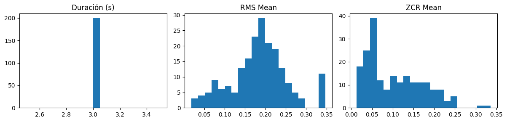
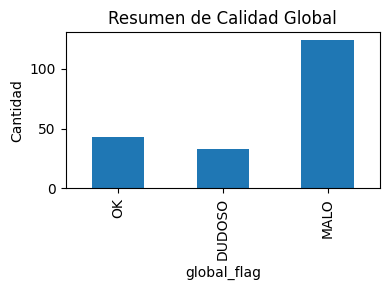

# 📊 UT4 — Extra: Dashboard de Control de Calidad para Audio (QA)

---

# 🌍 Contexto

En la UT4 trabajé con audio como tipo de dato especial: preprocesamiento, extracción de MFCCs y análisis básico de señales.  
En esta tarea extra quise dar un paso más hacia una mirada de **MLOps / monitoreo de datos**, construyendo un **dashboard de calidad** para un subconjunto del dataset UrbanSound8K.

La idea central es simple: antes de entrenar modelos de clasificación de audio, necesito saber **qué tan confiable es el dataset** que estoy alimentando al pipeline.

---

# 🎯 Objetivos

**Objetivo general**

- Diseñar un **Dashboard de QA** para audios que permita identificar grabaciones problemáticas después del preprocesamiento estándar.

**Objetivos específicos**

- Estandarizar un lote de audios a misma duración y sample rate.
- Calcular métricas simples por archivo (duración, energía, “ruidosidad”).
- Definir umbrales tipo **semáforo** (OK / DUDOSO / MALO).
- Resumir qué porcentaje del dataset cae en cada categoría y discutir implicancias para modelado.

---

# 📦 Dataset

- **Fuente**: [UrbanSound8K](https://www.kaggle.com/datasets/chrisfilo/urbansound8k)
- **Tipo**: clips de audio urbanos etiquetados (sirenas, bocinas, etc.).
- **Subset usado**: primeros **200 audios** encontrados en la estructura del dataset.
- **Formato**: archivos `.wav` (y otros), leídos desde la ruta provista por `kagglehub`.

Cada archivo se procesa de forma independiente, pero usando exactamente el mismo pipeline de estandarización que en la práctica principal de la UT4.

---

# 🧹 Limpieza y preprocesamiento

Se reutilizó el pipeline estándar de la UT4:

- Conversión a **mono** (promedio de canales).
- **Trim de silencios**: `librosa.effects.trim(y, top_db=30.0)`.
- **Resampleo** a `TARGET_SR = 16000 Hz`.
- **Recorte / padding** a `TARGET_DURATION = 3.0 s`.
- **Normalización de amplitud** a `TARGET_AMPLITUDE = 0.99`.

Después de este pipeline, todos los audios quedan:

- Con la misma **duración nominal** (3.0 s).
- Con el mismo **sample rate**.
- Con amplitud normalizada para evitar clipping.

---

# 🔍 EDA (exploración de calidad)

Para cada uno de los ~200 audios estandarizados se calcularon las siguientes métricas:

- `duration_sec`: duración efectiva en segundos.
- `rms_mean`: energía promedio de la señal (Root Mean Square).
- `zcr_mean`: tasa de cruces por cero, usada como proxy de **ruido / transitorios**.

Se generaron histogramas para cada métrica:

## Histogramas de métricas

Los histogramas muestran tres cosas importantes:
- La duración está perfectamente controlada (todos los audios quedan en 3.0 s).
- La energía RMS es muy variable: hay señales extremadamente débiles y otras excesivamente fuertes.
- La ZCR muestra una cola larga hacia la derecha, evidenciando audios ruidosos o con muchos transitorios.

Esta exploración ya sugiere que, aunque el pipeline es consistente, el **dataset en sí es muy heterogéneo**.

---

# ⚙️ Análisis técnico

## 1. Semáforo de calidad

Se definieron umbrales tipo semáforo:

- **Duración**
  - OK: |dur − TARGET_DURATION| ≤ 0.3 s  
  - DUDOSO: hasta el doble de esa tolerancia  
  - MALO: desvíos todavía mayores  

- **RMS** y **ZCR**
  - Se usaron **cuantiles 20% y 80%** para definir rangos “normales”.
  - Valores fuera de `[q20, q80]` → MALO.
  - Valores cerca de los bordes → DUDOSO.
  - Resto → OK.

Luego se definió un **flag global por archivo**:

- Si alguna métrica está en **MALO** → `global_flag = MALO`.
- Si no hay MALO pero hay al menos un **DUDOSO** → `global_flag = DUDOSO`.
- Si todo es OK → `global_flag = OK`.

## 2. Resultados numéricos

Sobre los ~200 audios analizados se obtuvo:

## Resumen global de calidad

El semáforo global resume de forma simple la calidad del lote:
- Aproximadamente **1 de cada 5** audios está en condiciones óptimas.
- Un **16%** requiere revisión (señal dudosa).
- Un **62%** presenta problemas claros de ruido o energía.

Este tipo de panel es útil para decidir si conviene filtrar, regrabar o aplicar preprocesamientos más agresivos.

La gran mayoría de problemas vienen de:

- RMS muy bajo (audios muy débiles).
- RMS muy alto (posible clipping).
- ZCR muy alta (ruido fuerte o muchos transitorios).

## 3. Nota ética / de diseño de datos

Usar un semáforo estricto tiene ventajas y riesgos:

- **Ventaja**: detecta fácilmente audios potencialmente inutilizables o claramente defectuosos.
- **Riesgo**: si los criterios son muy agresivos, se puede descartar material valioso, sesgar el dataset hacia ciertas condiciones de grabación y reducir la diversidad de escenarios.

En un sistema productivo, estos umbrales deberían:

- Estar **documentados**,  
- Poder **ajustarse**,  
- Y combinarse con **revisión humana** al menos en una muestra.

---

# 🧠 Resultados y discusión

Los resultados del dashboard muestran que:

1. **El pipeline de preprocesamiento funciona correctamente** en términos de duración y sample rate: todos los audios quedan con 3.0 s y condiciones homogéneas de muestreo.
2. A pesar de esto, el dataset presenta una **variabilidad enorme** en energía y ruido:
   - Muchos audios son demasiado débiles o demasiado fuertes.
   - Otros parecen extremadamente ruidosos según la ZCR.
3. Más de la mitad de los audios quedan marcados como **MALO** bajo un criterio estricto.

Esto sugiere que, antes de entrenar un modelo de clasificación de audio, es importante:

- Revisar al menos una parte de esos audios “malos”.
- Considerar regrabaciones, filtrados adicionales o exclusión selectiva.
- Documentar la **política de QA** que se aplica al dataset.

El dashboard no resuelve el problema, pero da una **foto rápida del estado del corpus**, que es exactamente lo que se busca en una etapa de QA.

---

# 🔗 Conexión con otras unidades

- **UT1–UT2 (Data pipelines / IO y limpieza):**  
  Aquí se retoma la idea de construir **pipelines reproducibles**, pero aplicada a audio.  
  El dashboard se podría automatizar como un paso más del pipeline de ingestión.

- **UT3 (Feature Engineering y validación):**  
  La calidad de las features MFCC depende fuertemente de la calidad de la señal.  
  Este QA actúa como una **capa previa** a la ingeniería de features.

- **UT4 (Datos especiales – audio):**  
  Se conecta directamente con la práctica de MFCC y preprocesamiento, pero ahora con foco en **monitorear calidad**, no solo en extraer features.

---

# 🧩 Reflexión final

Esta tarea extra me sirvió para:

- Ver que **no alcanza con “tener el dataset”**: hay que mirarlo críticamente.
- Experimentar con métricas muy simples (duración, RMS, ZCR) que, sin embargo, dan información poderosa sobre la salud del corpus.
- Pensar el audio desde la perspectiva de **calidad de datos**, no solo como insumo para un modelo.

La conclusión principal es que un pipeline de audio serio debería incluir algún tipo de **Dashboard de QA** como el que construí acá, para evitar entrenar modelos sobre datos ruidosos o directamente defectuosos.

---

# 🧰 Stack técnico

- **Lenguaje**: Python
- **Librerías principales**:
  - `librosa` (carga de audio, MFCC, ZCR, RMS, trim)
  - `numpy`, `pandas`
  - `matplotlib` (visualizaciones)
  - `kagglehub` (descarga del dataset UrbanSound8K)
- **Dataset**: UrbanSound8K (subset de 200 audios)
- **Pipeline propio**:
  - `preprocess_audio` (mono, trim, resampleo, duración fija, normalización)
  - Cálculo de métricas por archivo y flags de calidad.

---

# Evidencias

### 📝 [Notebook](../../../notebooks/UT4-extra-audio-qa.ipynb)

---

# 📚 Referencias

- UrbanSound8K dataset — Kaggle.  
- Librosa documentation: audio loading, feature extraction, effects.  
- Material de la UT4 – Audio como dato (preprocesamiento y extracción de MFCCs).